[TOC]

# 概述

Kubernetes系统使用client-go作为Go语言的官方编程式交互客户端库，提供对Kubernetes API Server服务的交互访问。Kubernetes的源码中已经集成了client-go的源码，无须单独下载。client-go源码路径为vendor/k8s.io/client-go。

# 源码结构

## 目录结构

代码位置：https://github.com/kubernetes/client-go

 

- kubernetes: 包含所有 k8s api 的 clients，提供 clientSet 客户端
- informers: 包含所有内置资源的 informer
- listeners: 为每一个 K8s 资源提供 Lister 功能，该功能对 Get 和 List 请求提供只读的缓存睡觉
- plugin/pkg/client/auth：提供 OpenStack、GCP 和 Azure 等云服务商授权插件
- rest: 提供 RESTClient 客户端，对 k8s API Server 执行 RESTful 操作
- tools：提供常用工具，例如 SharedInformer、Reflector、DealtFIFO 及 Indexers。提供Client 查询和缓存机制，以减少向 kube-apiserver 发起的请求数等。
- transport：提供安全的 TCP 连接，支持 Http Stream，某些操作需要在客户端和容器之间传输二进制流，例如 `exec`、`attach` 等操作，该功能有内部的 spdy 包提供支持
- dynamic： 提供 DynamicClient 动态客户端
- discovery：提供 DiscoveryClient 发现客户端
- util: 提供常用方法，例如 WorkQueue 工作队列，Certificate 证书管理等

## 控制器逻辑

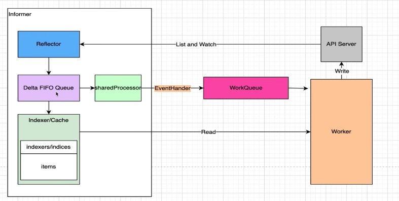

- **观察**：通过监控 Kubernetes 资源对象变化的事件来获取当前对象状态，我们只需要注入 `EventHandler` 让 client-go 将变化的时间对象信息放入 `WorkQueue` 中。
- **分析**：确认当前状态和期望状态的不同，由 Worker 完成
- **执行**：执行能够驱动对象当前状态变化的操作，由  Worker 完成
- **更新**：更新对象的当前状态，由 Worker 完成


# Client 客户端

client-go支持4种Client客户端对象与Kubernetes API Server交互的方式：

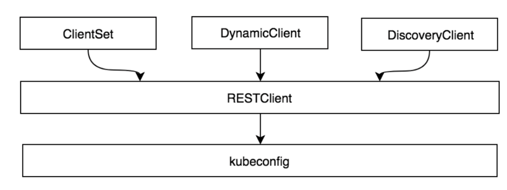

- **RESTClient**：最基础的客户端，提供了最基本的封装，实现了 RESTful 风格的 API。ClientSet、DynamicClient及DiscoveryClient客户端都是基于RESTClient实现的。

- **ClientSet**：是一个 Client 的集合，在 ClientSet 中包含了所有 k8s 内置资源的 Client（在RESTClient的基础上封装了对 Resource 和 Version 的管理方法），通过 Clientset 可以很方便的操作如 Pod、Service 这些资源。

- **dynamicClient**：动态客户端，可以操作任意 k8s 资源，包括 CRD 自定义资源

- **DiscoverClient**：用于发现 K8s 提供的资源组、资源版本和资源信息，比如：`kubectl api-resource`


## kubeconfig

kubeconfig 配置信息通常包含 3 个部分：

- **clusters** ：定义 Kubernetes 集群信息，例如 kube-apiserver 的服务地址及集群的证书信息等。

- **users** ：定义 Kubernetes 集群用户身份验证的客户端凭据，例如 client-certificate、client-key、token及username/password 等。
- **contexts** ：定义 Kubernetes 集群用户信息和命名空间等，用于将请求发送到指定的集群。


## RESTClient客户端

### 概述

- **RESTClientFor**：为创建 `RESTClient` 准备 config，比如限速器、编解码器等
- **UnversionedRESTClientFor**：与 `RESTClientFor` 类似，只是允许 `config.GroupVersion` 为空

```go
...
config, err := clientcmd.BuildConfigFromFlags("", "/root/.kube/config")
...
restclient, err := rest.RESTClientFor(config)
```

ClientSet 仅能访问Kubernetes自身内置的资源（即客户端集合内的资源），不能直接访问 CRD 自定义资源。如果需要 ClientSet 访问 CRD 自定义资源，可以通过client-gen代码生成器重新生成 ClientSet，在 ClientSet 集合中自动生成与 CRD 操作相关的接口


### 代码示例

初始化环境：

```bash
go mod init github.com/my-git9/kubernetes-dev/client-go-demo/01

# 下载 client-go
go get k8s.io/client-go
```

代码示例：

[demo1](./client-go-demo/01)

```go
package main

import (
	"context"

	v1 "k8s.io/api/core/v1"
	"k8s.io/client-go/kubernetes/scheme"
	"k8s.io/client-go/rest"
	"k8s.io/client-go/tools/clientcmd"
)

func main()  {
	// config
	config, err := clientcmd.BuildConfigFromFlags("", "/Users/xin/.kube/config")
	if err != nil{
		panic(err)
	}
  // RESTClientFor 要求必须要有 GroupVersion 和 NegotiatedSerializer
	config.GroupVersion = &v1.SchemeGroupVersion
  // APIPath 需要定义，此 2 个参数设置后，代表请求路径为 "/api/v1"
	config.APIPath = "api"
  // 数据的编解码器
	config.NegotiatedSerializer = scheme.Codecs

	// client
	restclient, err := rest.RESTClientFor(config)
	if err != nil{
		panic(err)
	}

	// get data
	pod := v1.Pod{}
  // 拼接 url: /api/v1/namespaces/default/pods/details-v1-5f6994d866-jf2dh
  // Do 会真正执行
  // Into 将结果放入变量中
	err = restclient.Get().Namespace("default").Resource("pods").Name("details-v1-5f6994d866-jf2dh").Do(context.TODO()).Into(&pod)
	if err != nil{
		panic(err)
	} else {
		println(pod.Status.PodIP)
	}
}
```


## ClientSet

### 概述

使用方式

```go
...
config, err := clientcmd.BuildConfigFromFlags("", "/root/.kube/config")
...
clientset, err := kubernetes.NewForConfig(config)
deploymentsClient := clientset.AppsV1().Deployments
```

### 代码示例

初始化环境

```shell
go mod init github.com/my-git9/kubernetes-dev/client-go-demo/02

# 下载 client-go
go get k8s.io/client-go
```

[demo2](./client-go-demo/02)

```go
package main

import (
	"context"
	metav1 "k8s.io/apimachinery/pkg/apis/meta/v1"
	"k8s.io/client-go/kubernetes"
	"k8s.io/client-go/tools/clientcmd"
)

func main()  {
	config, err := clientcmd.BuildConfigFromFlags("", "/Users/xin/.kube/config")
	if err != nil{
		panic(err)
	}

	clientset, err := kubernetes.NewForConfig(config)
	deploymentsClient, err := clientset.AppsV1().Deployments("default").List(context.TODO(), metav1.ListOptions{})
	if err != nil{
		panic(err)
	} else {
		deploymentlist := deploymentsClient.Items
		for _, deployment := range deploymentlist{
			println(deployment.Name)
		}
	}
}
```


## DynamicClient客户端

DynamicClient是一种动态客户端，它可以对任意Kubernetes资源进行RESTful操作，包括CRD自定义资源。DynamicClient与ClientSet操作类似，同样封装了RESTClient，同样提供了Create、Update、Delete、Get、List、Watch、Patch等方法。

注意 ：DynamicClient 不是类型安全的，因此在访问CRD自定义资源时需要特别注意。例如，在操作指针不当的情况下可能会导致程序崩溃。

DynamicClient 的处理过程将 Resource（例如 PodList）转换成 Unstructured 结构类型，Kubernetes 的所有Resource 都可以转换为该结构类型。处理完成后，再将 Unstructured 转换成 PodList。整个过程类似于 Go 语言的 interface{} 断言转换过程。另外，Unstructured 结构类型是通过 map[string]interface{} 转换的。

## 代码示例

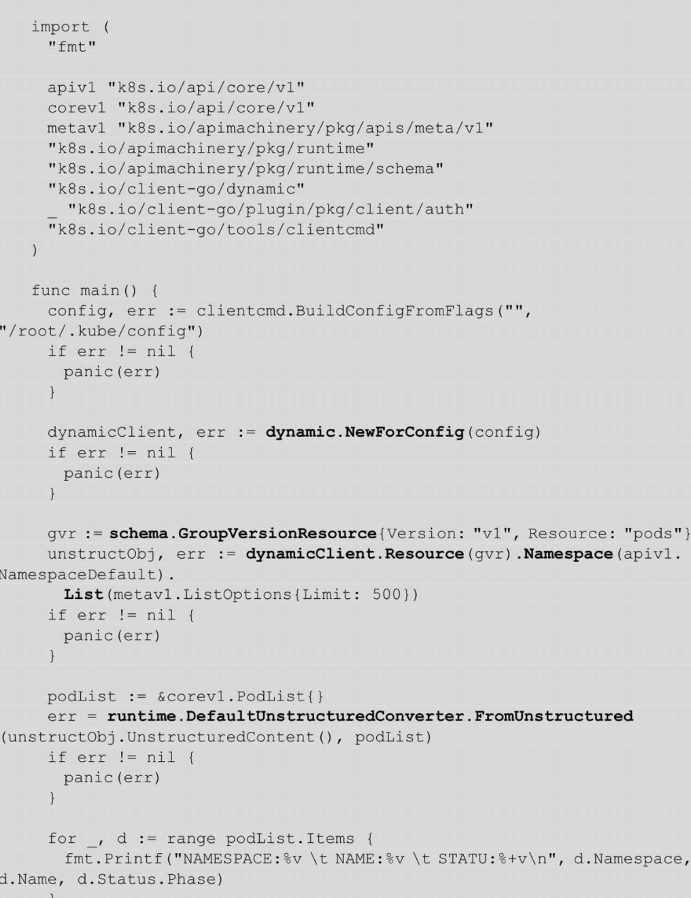


## DiscoveryClient客户端

DiscoveryClient 是发现客户端，它主要用于发现 KubernetesAPI Server 所支持的资源组、资源版本、资源信息。Kubernetes API Server 支持很多资源组、资源版本、资源信息，开发者在开发过程中很难记住所有信息，此时可以通过 DiscoveryClient 查看所支持的资源组、资源版本、资源信息。

kubectl 的 api-versions 和 api-resources 命令输出也是通过 DiscoveryClient 实现的。

代码示例：

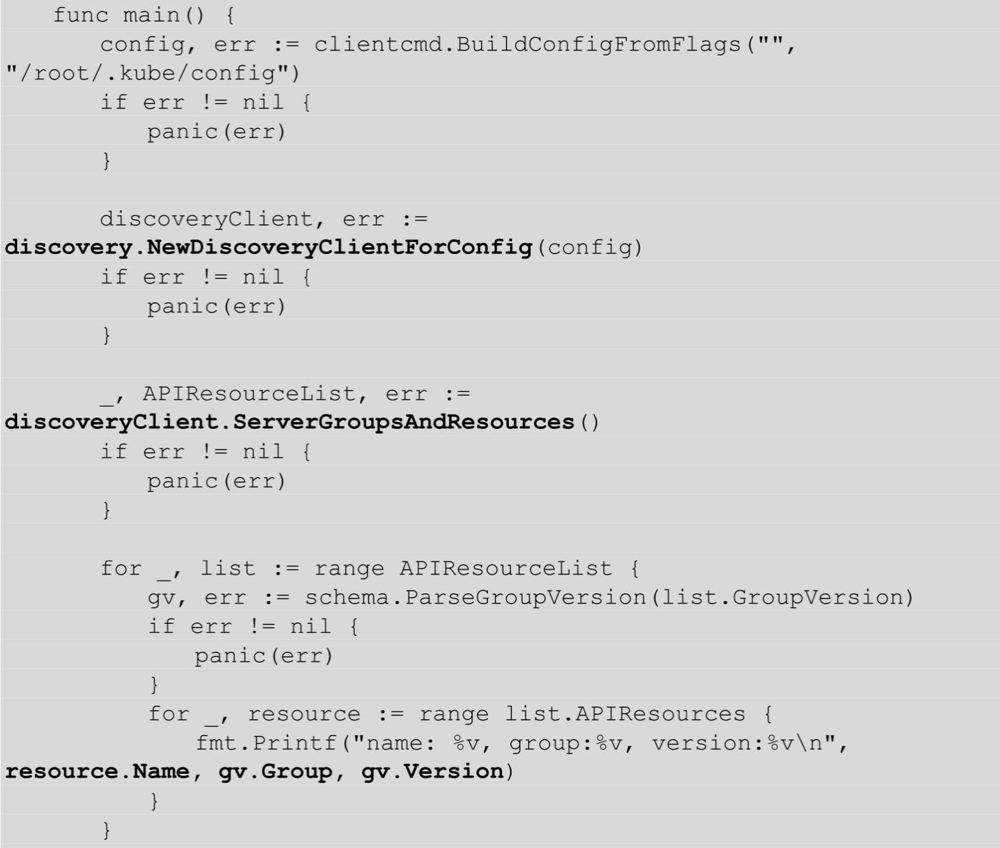

`discovery.NewDiscoveryClientForConfig` 通过 kubeconfig 配置信息实例化 discoveryClient 对象，该对象是用于发现Kubernetes API Server所支持的资源组、资源版本、资源信息的客户端。

`discoveryClient.ServerGroupsAndResources` 函数会返回 Kubernetes API Server所支持的资源组、资源版本、资源信息（即 APIResourceList），通过遍历 APIResourceList 输出信息。

### 获取Kubernetes API Server所支持的资源组、资源版本、资源信息

Kubernetes API Server 暴露出 /api 和 /apis 接口。DiscoveryClient 通过 RESTClient 分别请求 /api 和 /apis 接口，从而获取 Kubernetes API Server 所支持的资源组、资源版本、资源信息。

### 本地缓存的 DiscoveryClient

DiscoveryClient 可以将资源相关信息存储于本地，默认存储位置为 `～/.kube/cache` 和 `～/.kube/http-cache`。缓存可以减轻 client-go 对 Kubernetes API Server 的访问压力。默认每 10 分钟与 Kubernetes API Server 同步一次，同步周期较长，因为资源组、源版本、资源信息一般很少变动。

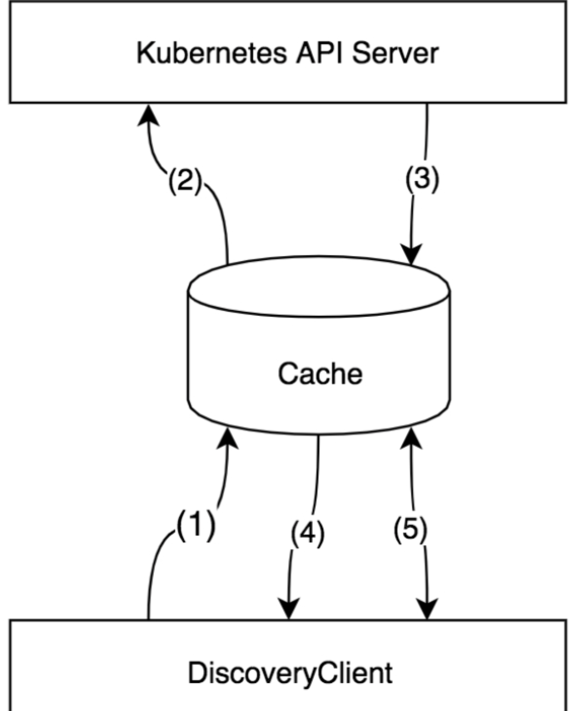

vendor/k8s.io/client-go/discovery/cached/disk/cached_discovery.go

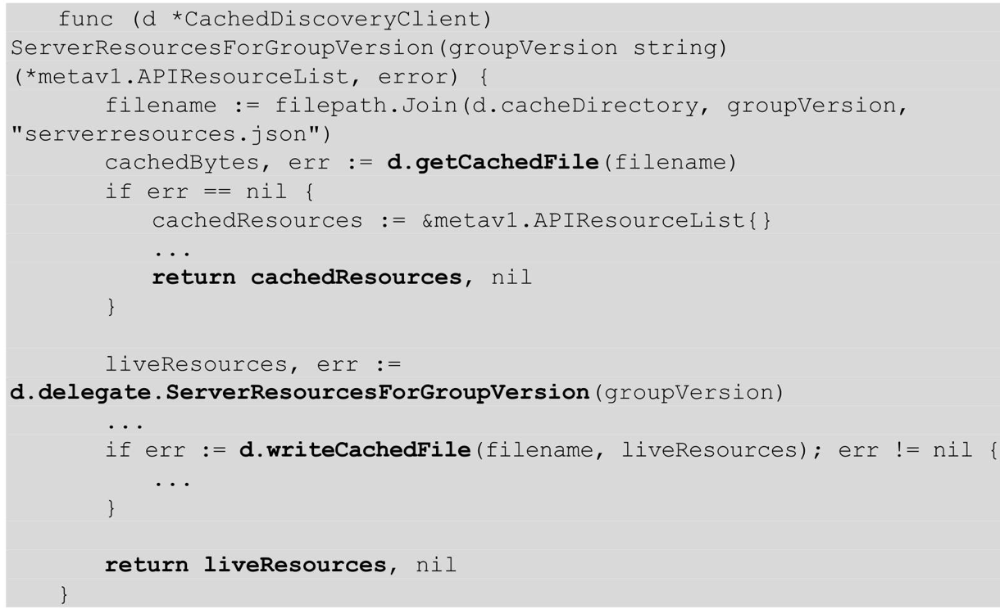


# Informer 机制

## 概述


核心组件：

- **Reflector**：**Reflector 用于监控（Watch）指定的 Kubernetes 资源**，当监控的资源发生变化时，触发相应的变更事件，例如 Added（资源添加）事件、Updated（资源更新）事件、Deleted（资源删除）事件，并将其资源对象存放到本地缓存 DeltaFIFO 中。
- **DeltaFIFO**：DeltaFIFO可以 分开理解，**FIFO是一个先进先出的队列**，它拥有队列操作的基本方法，例如`Add、Update、Delete、List、Pop、Close` 等，而 **Delta 是一个资源对象存储，它可以保存资源对象的操作类型**，例如 Added（添加）操作类型、Updated（更新）操作类型、Deleted（删除）操作类型、Sync（同步）操作类型等。
- **Indexer**：Indexer 是 client-go 用来存储资源对象并自带索引功能的本地存储，Reflector 从 DeltaFIFO 中将消费出来的资源对象存储至 Indexer。Indexer 与 Etcd 集群中的数据完全保持一致。client-go 可以很方便地从本地存储中读取相应的资源对象数据，而无须每次从远程 Etcd 集群中读取，以减轻 Kubernetes API Server 和 Etcd 集群的压力。


**资源Informer**：每一个Kubernetes资源上都实现了Informer机制。每一个Informer上都会实现Informer和Lister方法，例如PodInformer，代码示例如下：

```go
tyep PodInformer interface {
  Informer() cache.SharedIndexIngromer
  Lister() v1.PodLister
}
```

调用不同资源的Informer，代码示例如下：

```go
podInformer := shareInformer.Core().v1().Pods().Informer
nodeInformer := shareInformer.Node().v1beta1().RuntimeClasses().Infromer
```

定义不同资源的 Informer，允许监控不同资源的资源事件，例如，监听 Node 资源对象，当 Kubernetes 集群中有新的节点（Node）加入时，client-go 能够及时收到资源对象的变更信息。

**Shared Informer共享机制**：

Informer也被称为 Shared Informer，它是可以共享使用的。在用 client-go 编写代码程序时，若同一资源的Informer被实例化了多次，每个Informer使用一个Reflector，那么会运行过多相同的ListAndWatch，太多重复的序列化和反序列化操作会导致 Kubernetes API Server 负载过重。

Shared Informer可以使同一类资源Informer共享一个Reflector，这样可以节约很多资源。通过map数据结构实现共享的Informer机制。Shared Informer定义了一个map数据结构，用于存放所有Informer的字段。

代码路径：vendor/k8s.io/client-go/informers/factory.go

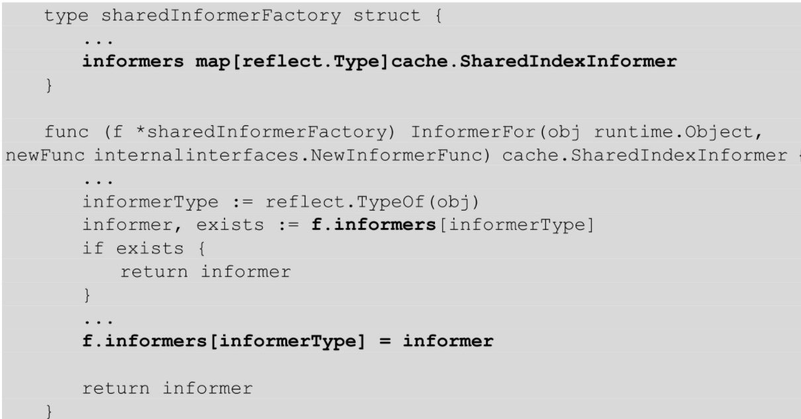

informers 字段中存储了资源类型和对应于 SharedIndexInformer 的映射关系。InformerFor 函数添加了不同资源的 Informer，在添加过程中如果已经存在同类型的资源 Informer，则返回当前 Informer，不再继续添加。

最后通过 Shared Informer 的 Start 方法使 `f.informers` 中的每个 informer 通过 goroutine 持久运行。


## Reflector

通过 NewReflector 实例化 Reflector 对象，实例化过程中须传入 ListerWatcher 数据接口对象，它拥有 List 和Watch 方法，用于获取及监控资源列表。只要实现了 List 和 Watch 方法的对象都可以称为 ListerWatcher。Reflector 对象通过 Run 函数启动监控并处理监控事件。而在 Reflector 源码实现中，其中最主要的是ListAndWatch 函数，它负责获取资源列表（List）和监控（Watch）指定的 Kubernetes API Server 资源。

ListAndWatch函数实现可分为两部分：第 1 部分获取资源列表数据，第 2 部分监控资源对象。


**通过 List 与 Watch 保证可靠性、实时性和顺序性**。

- List：指定类型资源对象的全量更新。并将其更新到缓存当中

```bash
curl -iv http://127.0.0.1:8001/api/v1/namespaces/default/pods
```

- Watch：指定类型资源对象的增量更新

```bash
curl -iv http://127.0.0.1:8001/api/v1/namespaces/default/pods\?watch\=true
```


### List

List 流程图：

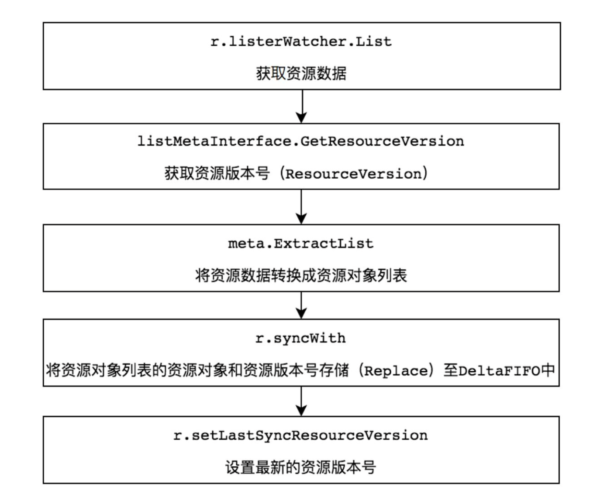

1. `r.listerWatcher.List` **用于获取资源下的所有对象的数据**，例如，获取所有 Pod 的资源数据。获取资源数据是由 options 的 ResourceVersion（资源版本号）参数控制的，如果 ResourceVersion 为 0，则表示获取所有 Pod 的资源数据。
2. `listMetaInterface.GetResourceVersion` **用于获取资源版本号**，ResourceVersion （资源版本号）非常重要，Kubernetes 中所有的资源都拥有该字段，它标识当前资源对象的版本号。每次修改当前资源对象时，**Kubernetes APIServer 都会更改 ResourceVersion，使得 client-go 执行 Watch 操作时可以根据ResourceVersion 来确定当前资源对象是否发生变化**。
3. `meta.ExtractList` 用于**将资源数据转换成资源对象列表**，将 `runtime.Object` 对象转换成 `[]runtime.Object` 对象。因为 `r.listerWatcher.List` 获取的是资源下的所有对象的数据，例如所有的Pod 资源数据，所以它是一个资源列表。
4. ` r.syncWith` **用于将资源对象列表中的资源对象和资源版本号存储至 DeltaFIFO 中，并会替换已存在的对象**。
5. `r.setLastSyncResourceVersion` 用于设置最新的资源版本号。

### watch

Watch（监控）操作通过 HTTP 协议与 Kubernetes API Server 建立长连接，接收 Kubernetes API Server 发来的资源变更事件。Watch 操作的实现机制使用 **HTTP 协议的分块传输编码（Chunked Transfer Encoding）**。当 client-go 调用 Kubernetes API Server 时，**Kubernetes API Server 在 Response 的 HTTP Header 中设置Transfer-Encoding 的值为 chunked，表示采用分块传输编码，客户端收到该信息后，便与服务端进行连接，并等待下一个数据块（即资源的事件信息）**。

ListAndWatch Watch代码示例如下：

代码路径：vendor/k8s.io/client-go/tools/cache/reflector.go

```go
		if w == nil {
			timeoutSeconds := int64(minWatchTimeout.Seconds() * (rand.Float64() + 1.0))
			options := metav1.ListOptions{
				ResourceVersion: r.LastSyncResourceVersion(),
				// We want to avoid situations of hanging watchers. Stop any watchers that do not
				// receive any events within the timeout window.
				TimeoutSeconds: &timeoutSeconds,
				// To reduce load on kube-apiserver on watch restarts, you may enable watch bookmarks.
				// Reflector doesn't assume bookmarks are returned at all (if the server do not support
				// watch bookmarks, it will ignore this field).
				AllowWatchBookmarks: true,
			}
      w, err = r.listerWatcher.Watch(options)
      ...
      err = watchHandler(start, w, r.store, r.expectedType, r.expectedGVK, r.name, r.typeDescription, r.setLastSyncResourceVersion, nil, r.clock, resyncerrc, stopCh)
    }
```

r.listerWatcher.Watch函数实际调用了Pod Informer下的WatchFunc函数，它通过ClientSet客户端与Kubernetes APIServer建立长连接，监控指定资源的变更事件：

代码路径：k8s.io/client-go/informers/core/v1/pod.go

```go
WatchFunc: func(options metav1.ListOptions) (watch.Interface, error) {
  if tweakListOptions != nil{
    tweakListOptions(&options)
  }
  return client.CoreV1().Pods(namespace).Watch(options)
}
```


## Reflector 的创建

### 创建 Reflector

```go
func NewReflector(lw ListerWatcher, expectedType interface{}, store Store, resyncPeriod time.Duration) *Reflector {
  ...
}
```

参数说明：

- `lw`：interface，包含了 interface Lister 和 Watcher。通过 ListerWatcher 获取初始化指定资源的列表和监听指定资源变化
- `expectedType`：指定资源类型
- `store`：指定存储，需要实现 Store 这个 interface
- `resyncPeriod`：同步周期


### ResourceVersion 与 Bookmarks

#### ResourceVersion

- 保证客户端数据一致性和顺序性
- 并发控制

#### Bookmarks

- 减少 `API Server` 负载
- 更新客户端保存的最近一次 `ResourceVersion`


### Reflector 与 RESTClient 关联

```go
&cache.ListWatch{
  ListFunc: func(options metav1.ListOptions) (runtime.Object, error){
    if tweakListOptions != nil {
      tweakListOptions(&options)
    }
    return client.CoreV1().Pods(namespace).List(context.TODO, options)
  }
  watchFunc: func(options metav1.ListOptions) (watch.Interface, error)
  if tweakListOptions != nil {
    tweakListOptions(&options)
  }
  return client.CoreV1.Pods(namespace).Watch(context.TODO, options)
}
```

K8s 中的 Pod listwatch 示例：

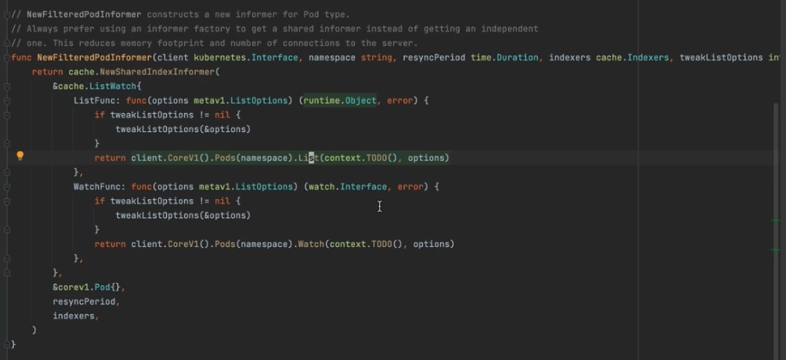


## DeltaFIFO

### Store 的类型

- **Cache**：实现 Store，利用 threadSafeMap 存放数据
- **UndeltaStore**：实现 Store，利用 cache 存放数据，数据变更时通过 PushFunc 发送当前的完整状态
- **FIFO**：实现 Queue（包含 Store），利用自己内部的 items 数据结构存放数据
- **DeltaFIFO**
- **Heap**：实现 Store，利用 data 数据结构存放数据，实现堆数据结构，用于优先级队列
- **ExpirationCache**：实现 Store，利用 threadSafeMap 存放数据


### 基本原理

DeltaFIFO 可以分开理解，**FIFO 是一个先进先出的队列，它拥有队列操作的基本方法**，例如Add、Update、Delete、List、Pop、Close等，而 **Delta是一个资源对象存储，它可以保存资源对象的操作类型**，例如Added（添加）操作类型、Updated（更新）操作类型、Deleted（删除）操作类型、Sync（同步）操作类型等。

代码路径：vendor/k8s.io/client-go/tools/cache/delta_fifo.go

```go
type DeltaFIFO struct{
  ...
  items map[string]Deltas
  queue []string
  ...
}
type Deltas []Delta
```

DeltaFIFO 与其他队列最大的不同之处是，它<font color="red">**会保留所有关于资源对象（obj）的操作类型**，**队列中会存在拥有不同操作类型的同一个资源对象，消费者在处理该资源对象时能够了解该资源对象所发生的事情。**</font>queue 字段存储资源对象的 key，该 key 通过 `KeyOf `函数计算得到。**items 字段通过 map 数据结构的方式存储，value 存储的是对象的 Deltas 数组**。DeltaFIFO 存储结构如图：

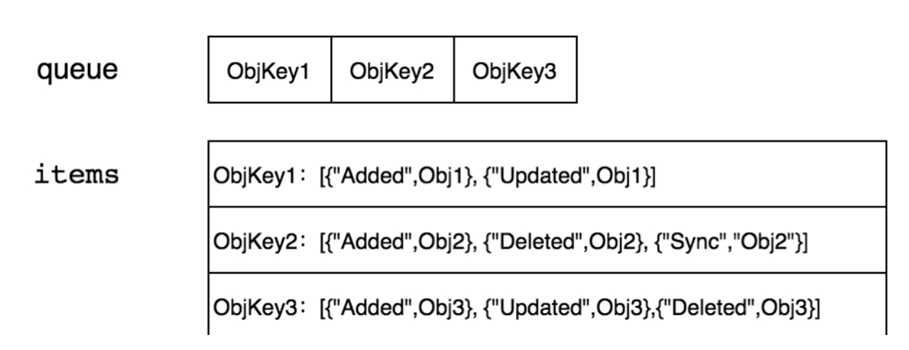

DeltaFIFO 本质上是一个先进先出的队列，有数据的生产者和消费者，其中生产者是 `Reflector` 调用的 `Add` 方法，消费者是 `Controller` 调用的 `Pop` 方法。

#### 生产者方法

DeltaFIFO 队列中的资源对象在 `Added`（资源添加）事件、`Updated`（资源更新）事件、`Deleted`（资源删除）事件中都调用了 `queueActionLocked` 函数，它是 `DeltaFIFO`实现的关键，代码示例如下：

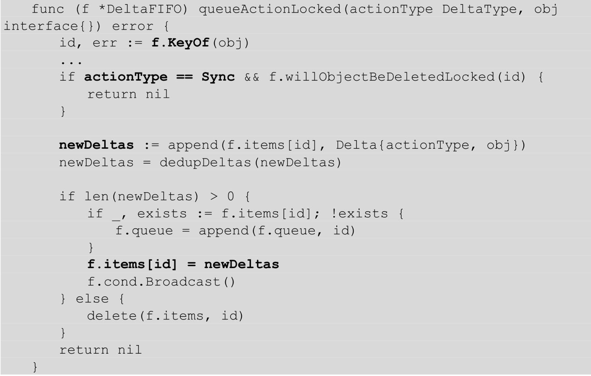

- 当队列中没有数据时，通过 `f.cond.wait` 阻塞等待数据，只有收到 `cond.Broadcast` 时才说明有数据被添加，解除当前阻塞状态。

- 如果队列中不为空，取出 `f.queue` 的头部数据，将该对象传入 `process` 回调函数，由上层消费者进行处理。

- 如果 `process` 回调函数处理出错，则将该对象重新存入队列。


