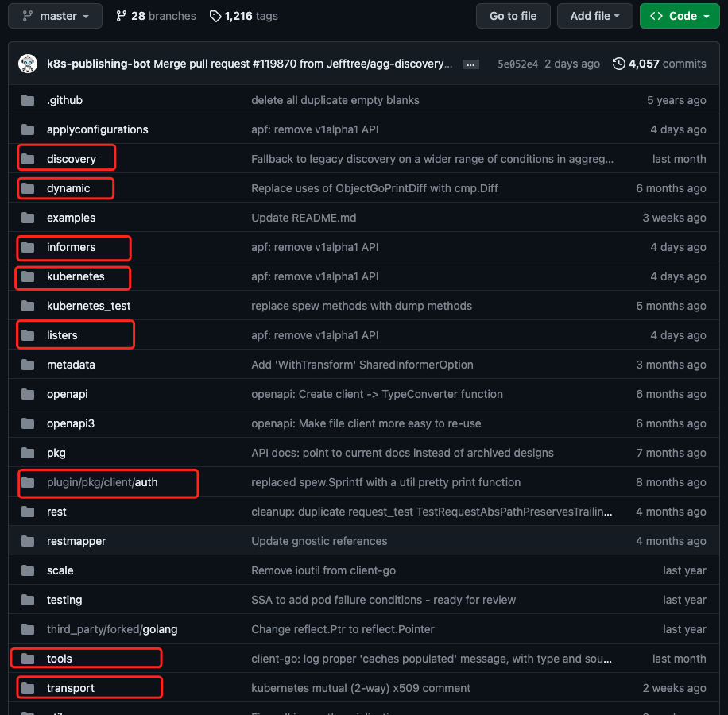

# 概述

代码位置：https://github.com/kubernetes/client-go

 

- kubernetes: 包含所有 k8s api 的 clients
- informers: 包含所有内置资源的 informer
- listeners:
- plugin/pkg/client/auth
- tools
- transport
- dynamic
- discovery

