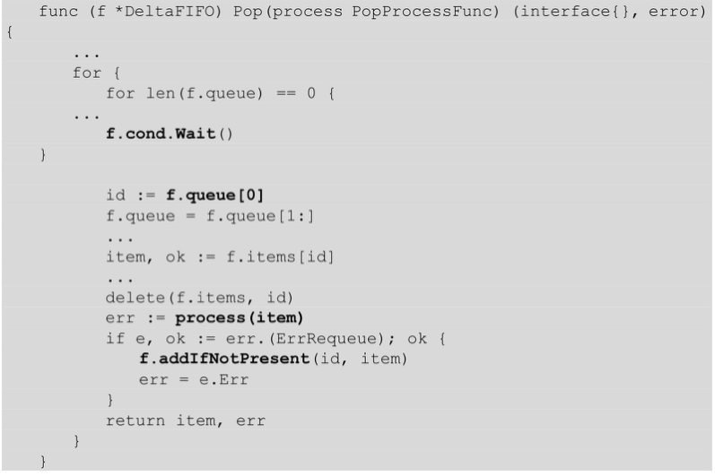
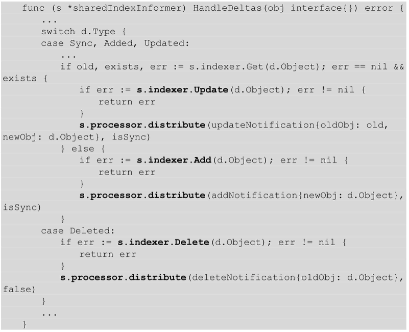
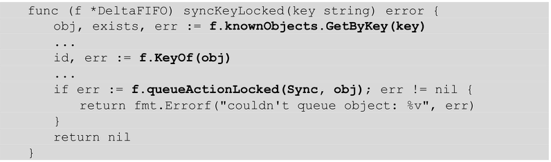
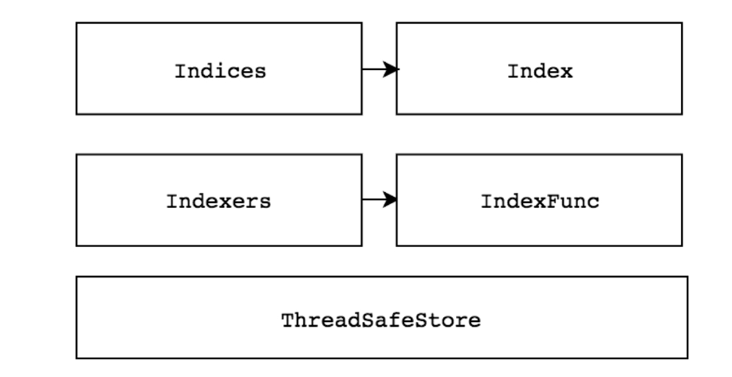
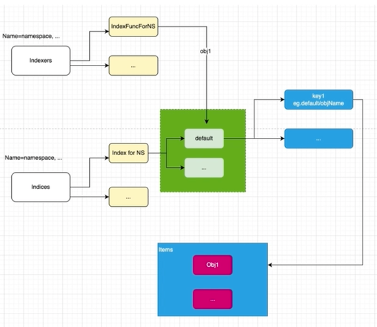
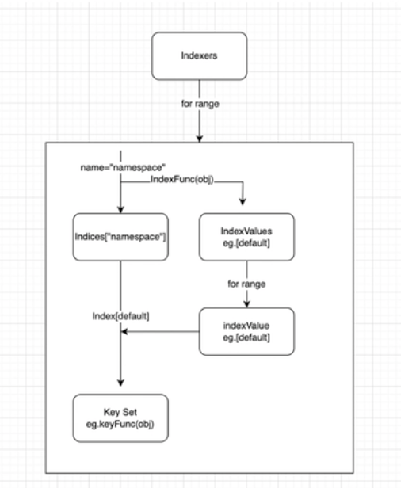

[TOC]

# 概述

Kubernetes系统使用client-go作为Go语言的官方编程式交互客户端库，提供对Kubernetes API Server服务的交互访问。Kubernetes的源码中已经集成了client-go的源码，无须单独下载。client-go源码路径为vendor/k8s.io/client-go。

# 源码结构

## 目录结构

代码位置：https://github.com/kubernetes/client-go

 

- kubernetes: 包含所有 k8s api 的 clients，提供 clientSet 客户端
- informers: 包含所有内置资源的 informer
- listeners: 为每一个 K8s 资源提供 Lister 功能，该功能对 Get 和 List 请求提供只读的缓存睡觉
- plugin/pkg/client/auth：提供 OpenStack、GCP 和 Azure 等云服务商授权插件
- rest: 提供 RESTClient 客户端，对 k8s API Server 执行 RESTful 操作
- tools：提供常用工具，例如 SharedInformer、Reflector、DealtFIFO 及 Indexers。提供Client 查询和缓存机制，以减少向 kube-apiserver 发起的请求数等。
- transport：提供安全的 TCP 连接，支持 Http Stream，某些操作需要在客户端和容器之间传输二进制流，例如 `exec`、`attach` 等操作，该功能有内部的 spdy 包提供支持
- dynamic： 提供 DynamicClient 动态客户端
- discovery：提供 DiscoveryClient 发现客户端
- util: 提供常用方法，例如 WorkQueue 工作队列，Certificate 证书管理等

## 控制器逻辑


- **观察**：通过监控 Kubernetes 资源对象变化的事件来获取当前对象状态，我们只需要注入 `EventHandler` 让 client-go 将变化的时间对象信息放入 `WorkQueue` 中。
- **分析**：确认当前状态和期望状态的不同，由 Worker 完成
- **执行**：执行能够驱动对象当前状态变化的操作，由  Worker 完成
- **更新**：更新对象的当前状态，由 Worker 完成


# Client 客户端

client-go 支持 4 种Client客户端对象与 Kubernetes API Server 交互的方式：


- **RESTClient**：最基础的客户端，提供了最基本的封装，实现了 RESTful 风格的 API。ClientSet、DynamicClient 及 DiscoveryClient客户端都是基于 RESTClient 实现的。

- **ClientSet**：是一个 Client 的集合，在 ClientSet 中包含了所有 k8s 内置资源的 Client（在RESTClient的基础上封装了对 Resource 和 Version 的管理方法），通过 Clientset 可以很方便的操作如 Pod、Service 这些资源。

- **dynamicClient**：动态客户端，可以操作任意 k8s 资源，包括 CRD 自定义资源

- **DiscoverClient**：用于发现 K8s 提供的资源组、资源版本和资源信息，比如：`kubectl api-resource`


## kubeconfig

kubeconfig 配置信息通常包含 3 个部分：

- **clusters** ：定义 Kubernetes 集群信息，例如 kube-apiserver 的服务地址及集群的证书信息等。

- **users** ：定义 Kubernetes 集群用户身份验证的客户端凭据，例如 client-certificate、client-key、token 及 username/password 等。
- **contexts** ：定义 Kubernetes 集群用户信息和命名空间等，用于将请求发送到指定的集群。


## RESTClient客户端

### 概述

- **RESTClientFor**：为创建 `RESTClient` 准备 config，比如限速器、编解码器等
- **UnversionedRESTClientFor**：与 `RESTClientFor` 类似，只是允许 `config.GroupVersion` 为空

```go
...
config, err := clientcmd.BuildConfigFromFlags("", "/root/.kube/config")
...
restclient, err := rest.RESTClientFor(config)
```

ClientSet 仅能访问 Kubernetes 自身内置的资源（即客户端集合内的资源），不能直接访问 CRD 自定义资源。如果需要 ClientSet 访问 CRD 自定义资源，可以通过 client-gen 代码生成器重新生成 ClientSet，在 ClientSet 集合中自动生成与 CRD 操作相关的接口


### 代码示例

初始化环境：

```bash
go mod init github.com/my-git9/kubernetes-dev/client-go-demo/01

# 下载 client-go
go get k8s.io/client-go
```

代码示例：

[demo1](./client-go-demo/01)

```go
package main

import (
	"context"

	v1 "k8s.io/api/core/v1"
	"k8s.io/client-go/kubernetes/scheme"
	"k8s.io/client-go/rest"
	"k8s.io/client-go/tools/clientcmd"
)

func main()  {
	// config
	config, err := clientcmd.BuildConfigFromFlags("", "/Users/xin/.kube/config")
	if err != nil{
		panic(err)
	}
  // RESTClientFor 要求必须要有 GroupVersion 和 NegotiatedSerializer
	config.GroupVersion = &v1.SchemeGroupVersion
  // APIPath 需要定义，此 2 个参数设置后，代表请求路径为 "/api/v1"
	config.APIPath = "api"
  // 数据的编解码器
	config.NegotiatedSerializer = scheme.Codecs

	// client
	restclient, err := rest.RESTClientFor(config)
	if err != nil{
		panic(err)
	}

	// get data
	pod := v1.Pod{}
  // 拼接 url: /api/v1/namespaces/default/pods/details-v1-5f6994d866-jf2dh
  // Do 会真正执行
  // Into 将结果放入变量中
	err = restclient.Get().Namespace("default").Resource("pods").Name("details-v1-5f6994d866-jf2dh").Do(context.TODO()).Into(&pod)
	if err != nil{
		panic(err)
	} else {
		println(pod.Status.PodIP)
	}
}
```


## ClientSet

### 概述

使用方式

```go
...
config, err := clientcmd.BuildConfigFromFlags("", "/root/.kube/config")
...
clientset, err := kubernetes.NewForConfig(config)
deploymentsClient := clientset.AppsV1().Deployments
```

### 代码示例

初始化环境

```shell
go mod init github.com/my-git9/kubernetes-dev/client-go-demo/02

# 下载 client-go
go get k8s.io/client-go
```

[demo2](./client-go-demo/02)

```go
package main

import (
	"context"
	metav1 "k8s.io/apimachinery/pkg/apis/meta/v1"
	"k8s.io/client-go/kubernetes"
	"k8s.io/client-go/tools/clientcmd"
)

func main()  {
	config, err := clientcmd.BuildConfigFromFlags("", "/Users/xin/.kube/config")
	if err != nil{
		panic(err)
	}

	clientset, err := kubernetes.NewForConfig(config)
	deploymentsClient, err := clientset.AppsV1().Deployments("default").List(context.TODO(), metav1.ListOptions{})
	if err != nil{
		panic(err)
	} else {
		deploymentlist := deploymentsClient.Items
		for _, deployment := range deploymentlist{
			println(deployment.Name)
		}
	}
}
```


## DynamicClient客户端

DynamicClient是一种动态客户端，它可以对任意Kubernetes资源进行RESTful操作，包括CRD自定义资源。DynamicClient与ClientSet操作类似，同样封装了RESTClient，同样提供了Create、Update、Delete、Get、List、Watch、Patch等方法。

注意 ：DynamicClient 不是类型安全的，因此在访问 CRD 自定义资源时需要特别注意。例如，在操作指针不当的情况下可能会导致程序崩溃。

DynamicClient 的处理过程**将 Resource（例如 PodList）转换成 Unstructured 结构类型**，Kubernetes 的所有 Resource 都可以转换为该结构类型。处理完成后，**再将 Unstructured 转换成 PodList**。整个过程类似于 Go 语言的 `interface{}` 断言转换过程。另外，Unstructured 结构类型是通过 `map[string]interface{}` 转换的。

## 代码示例


## DiscoveryClient客户端

DiscoveryClient 是发现客户端，它主要用于发现 Kubernetes API Server 所支持的资源组、资源版本、资源信息。Kubernetes API Server 支持很多资源组、资源版本、资源信息，开发者在开发过程中很难记住所有信息，此时可以通过 DiscoveryClient 查看所支持的资源组、资源版本、资源信息。

kubectl 的 api-versions 和 api-resources 命令输出也是通过 DiscoveryClient 实现的。

代码示例：


`discovery.NewDiscoveryClientForConfig` 通过 kubeconfig 配置信息实例化 discoveryClient 对象，该对象是用于发现Kubernetes API Server所支持的资源组、资源版本、资源信息的客户端。

`discoveryClient.ServerGroupsAndResources` 函数会返回 Kubernetes API Server所支持的资源组、资源版本、资源信息（即 APIResourceList），通过遍历 APIResourceList 输出信息。

### 获取Kubernetes API Server所支持的资源组、资源版本、资源信息

Kubernetes API Server 暴露出 /api 和 /apis 接口。DiscoveryClient 通过 RESTClient 分别请求 /api 和 /apis 接口，从而获取 Kubernetes API Server 所支持的资源组、资源版本、资源信息。

### 本地缓存的 DiscoveryClient

DiscoveryClient 可以将资源相关信息存储于本地，默认存储位置为 `～/.kube/cache` 和 `～/.kube/http-cache`。缓存可以减轻 client-go 对 Kubernetes API Server 的访问压力。默认每 10 分钟与 Kubernetes API Server 同步一次，同步周期较长，因为资源组、源版本、资源信息一般很少变动。


`vendor/k8s.io/client-go/discovery/cached/disk/cached_discovery.go`


# Informer 机制

## 概述


核心组件：

- **Reflector**：**Reflector 用于监控（Watch）指定的 Kubernetes 资源**，当监控的资源发生变化时，触发相应的变更事件，例如 Added（资源添加）事件、Updated（资源更新）事件、Deleted（资源删除）事件，并将其资源对象存放到本地缓存 DeltaFIFO 中。
- **DeltaFIFO**：DeltaFIFO可以 分开理解，**FIFO是一个先进先出的队列**，它拥有队列操作的基本方法，例如`Add、Update、Delete、List、Pop、Close` 等，而 **Delta 是一个资源对象存储，它可以保存资源对象的操作类型**，例如 Added（添加）操作类型、Updated（更新）操作类型、Deleted（删除）操作类型、Sync（同步）操作类型等。
- **Indexer**：Indexer 是 client-go 用来存储资源对象并自带索引功能的本地存储，Reflector 从 DeltaFIFO 中将消费出来的资源对象存储至 Indexer。Indexer 与 Etcd 集群中的数据完全保持一致。client-go 可以很方便地从本地存储中读取相应的资源对象数据，而无须每次从远程 Etcd 集群中读取，以减轻 Kubernetes API Server 和 Etcd 集群的压力。


**资源Informer**：每一个Kubernetes资源上都实现了Informer机制。每一个Informer上都会实现Informer和Lister方法，例如PodInformer，代码示例如下：

```go
tyep PodInformer interface {
  Informer() cache.SharedIndexIngromer
  Lister() v1.PodLister
}
```

调用不同资源的Informer，代码示例如下：

```go
podInformer := shareInformer.Core().v1().Pods().Informer
nodeInformer := shareInformer.Node().v1beta1().RuntimeClasses().Infromer
```

定义不同资源的 Informer，允许监控不同资源的资源事件，例如，监听 Node 资源对象，当 Kubernetes 集群中有新的节点（Node）加入时，client-go 能够及时收到资源对象的变更信息。

**Shared Informer共享机制**：

Informer也被称为 Shared Informer，它是可以共享使用的。在用 client-go 编写代码程序时，若同一资源的Informer被实例化了多次，每个Informer使用一个Reflector，那么会运行过多相同的ListAndWatch，太多重复的序列化和反序列化操作会导致 Kubernetes API Server 负载过重。

Shared Informer可以使同一类资源Informer共享一个Reflector，这样可以节约很多资源。通过map数据结构实现共享的Informer机制。Shared Informer定义了一个map数据结构，用于存放所有Informer的字段。

代码路径：vendor/k8s.io/client-go/informers/factory.go


informers 字段中存储了资源类型和对应于 SharedIndexInformer 的映射关系。InformerFor 函数添加了不同资源的 Informer，在添加过程中如果已经存在同类型的资源 Informer，则返回当前 Informer，不再继续添加。

最后通过 Shared Informer 的 Start 方法使 `f.informers` 中的每个 informer 通过 goroutine 持久运行。


## Reflector

通过 NewReflector 实例化 Reflector 对象，实例化过程中须传入 ListerWatcher 数据接口对象，它拥有 List 和Watch 方法，用于获取及监控资源列表。只要实现了 List 和 Watch 方法的对象都可以称为 ListerWatcher。Reflector 对象通过 Run 函数启动监控并处理监控事件。而在 Reflector 源码实现中，其中最主要的是ListAndWatch 函数，它负责获取资源列表（List）和监控（Watch）指定的 Kubernetes API Server 资源。

ListAndWatch函数实现可分为两部分：第 1 部分获取资源列表数据，第 2 部分监控资源对象。


**通过 List 与 Watch 保证可靠性、实时性和顺序性**。

- List：指定类型资源对象的全量更新。并将其更新到缓存当中

```bash
curl -iv http://127.0.0.1:8001/api/v1/namespaces/default/pods
```

- Watch：指定类型资源对象的增量更新

```bash
curl -iv http://127.0.0.1:8001/api/v1/namespaces/default/pods\?watch\=true
```


### List

List 流程图：


1. `r.listerWatcher.List` **用于获取资源下的所有对象的数据**，例如，获取所有 Pod 的资源数据。获取资源数据是由 options 的 ResourceVersion（资源版本号）参数控制的，如果 ResourceVersion 为 0，则表示获取所有 Pod 的资源数据。
2. `listMetaInterface.GetResourceVersion` **用于获取资源版本号**，ResourceVersion （资源版本号）非常重要，Kubernetes 中所有的资源都拥有该字段，它标识当前资源对象的版本号。每次修改当前资源对象时，**Kubernetes APIServer 都会更改 ResourceVersion，使得 client-go 执行 Watch 操作时可以根据ResourceVersion 来确定当前资源对象是否发生变化**。
3. `meta.ExtractList` 用于**将资源数据转换成资源对象列表**，将 `runtime.Object` 对象转换成 `[]runtime.Object` 对象。因为 `r.listerWatcher.List` 获取的是资源下的所有对象的数据，例如所有的Pod 资源数据，所以它是一个资源列表。
4. ` r.syncWith` **用于将资源对象列表中的资源对象和资源版本号存储至 DeltaFIFO 中，并会替换已存在的对象**。
5. `r.setLastSyncResourceVersion` 用于设置最新的资源版本号。

### watch

Watch（监控）操作通过 HTTP 协议与 Kubernetes API Server 建立长连接，接收 Kubernetes API Server 发来的资源变更事件。Watch 操作的实现机制使用 **HTTP 协议的分块传输编码（Chunked Transfer Encoding）**。当 client-go 调用 Kubernetes API Server 时，**Kubernetes API Server 在 Response 的 HTTP Header 中设置Transfer-Encoding 的值为 chunked，表示采用分块传输编码，客户端收到该信息后，便与服务端进行连接，并等待下一个数据块（即资源的事件信息）**。

ListAndWatch Watch代码示例如下：

代码路径：vendor/k8s.io/client-go/tools/cache/reflector.go

```go
		if w == nil {
			timeoutSeconds := int64(minWatchTimeout.Seconds() * (rand.Float64() + 1.0))
			options := metav1.ListOptions{
				ResourceVersion: r.LastSyncResourceVersion(),
				// We want to avoid situations of hanging watchers. Stop any watchers that do not
				// receive any events within the timeout window.
				TimeoutSeconds: &timeoutSeconds,
				// To reduce load on kube-apiserver on watch restarts, you may enable watch bookmarks.
				// Reflector doesn't assume bookmarks are returned at all (if the server do not support
				// watch bookmarks, it will ignore this field).
				AllowWatchBookmarks: true,
			}
      w, err = r.listerWatcher.Watch(options)
      ...
      err = watchHandler(start, w, r.store, r.expectedType, r.expectedGVK, r.name, r.typeDescription, r.setLastSyncResourceVersion, nil, r.clock, resyncerrc, stopCh)
    }
```

r.listerWatcher.Watch函数实际调用了Pod Informer下的WatchFunc函数，它通过ClientSet客户端与Kubernetes APIServer建立长连接，监控指定资源的变更事件：

代码路径：k8s.io/client-go/informers/core/v1/pod.go

```go
WatchFunc: func(options metav1.ListOptions) (watch.Interface, error) {
  if tweakListOptions != nil{
    tweakListOptions(&options)
  }
  return client.CoreV1().Pods(namespace).Watch(options)
}
```


## Reflector 的创建

### 创建 Reflector

```go
func NewReflector(lw ListerWatcher, expectedType interface{}, store Store, resyncPeriod time.Duration) *Reflector {
  ...
}
```

参数说明：

- `lw`：interface，包含了 interface Lister 和 Watcher。通过 ListerWatcher 获取初始化指定资源的列表和监听指定资源变化
- `expectedType`：指定资源类型
- `store`：指定存储，需要实现 Store 这个 interface
- `resyncPeriod`：同步周期


### ResourceVersion 与 Bookmarks

#### ResourceVersion

- 保证客户端数据一致性和顺序性
- 并发控制

#### Bookmarks

- 减少 `API Server` 负载
- 更新客户端保存的最近一次 `ResourceVersion`


### Reflector 与 RESTClient 关联

```go
&cache.ListWatch{
  ListFunc: func(options metav1.ListOptions) (runtime.Object, error){
    if tweakListOptions != nil {
      tweakListOptions(&options)
    }
    return client.CoreV1().Pods(namespace).List(context.TODO, options)
  }
  watchFunc: func(options metav1.ListOptions) (watch.Interface, error)
  if tweakListOptions != nil {
    tweakListOptions(&options)
  }
  return client.CoreV1.Pods(namespace).Watch(context.TODO, options)
}
```

K8s 中的 Pod listwatch 示例：


## DeltaFIFO

### Store 的类型

- **Cache**：实现 Store，利用 threadSafeMap 存放数据
- **UndeltaStore**：实现 Store，利用 cache 存放数据，数据变更时通过 PushFunc 发送当前的完整状态
- **FIFO**：实现 Queue（包含 Store），利用自己内部的 items 数据结构存放数据
- **DeltaFIFO**
- **Heap**：实现 Store，利用 data 数据结构存放数据，实现堆数据结构，用于优先级队列
- **ExpirationCache**：实现 Store，利用 threadSafeMap 存放数据


### 应用场景

DeltaFIFO 主要用于以下场景中：

- 你希望每个对象的变化最多一次
- 当处理一个对象时，希望知道这个对象于你上次处理时，发生了哪些变化
- 一个对象删除时，仍然可以处理它
- 能够周期性的处理所有对象


### 基本原理

DeltaFIFO 可以分开理解，**FIFO 是一个先进先出的队列，它拥有队列操作的基本方法**，例如 ` Add、Update、Delete、List、Pop、Close` 等，而 **Delta是一个资源对象存储，它可以保存资源对象的操作类型**，例如 Added（添加）操作类型、Updated（更新）操作类型、Deleted（删除）操作类型、Sync（同步）操作类型等。

代码路径：vendor/k8s.io/client-go/tools/cache/delta_fifo.go

```go
type DeltaFIFO struct{
  ...
  // 存放 Delta
  // 与 queue 中存放的 key 是同样的 key
  items map[string]Deltas
  // 可以确保顺序性
  queue []string
  ...
  // 默认使用 MetaNamespaceKeyFunc，默认使用 <namespace>/<name> 的格式，不指定 namespaces 时用 <name>
  // 那么我们从队列 key里面可以获取到重要的信息了
  keyFunc Keyfunc
  // 其实就是 Indexer
  knownObjects KeyListerGetter
}
type Deltas []Delta
```

DeltaFIFO 与其他队列最大的不同之处是，它<font color="red">**会保留所有关于资源对象（obj）的操作类型**，**队列中会存在拥有不同操作类型的同一个资源对象，消费者在处理该资源对象时能够了解该资源对象所发生的事情。**</font>queue 字段存储资源对象的 key，该 key 通过 `KeyOf `函数计算得到。**items 字段通过 map 数据结构的方式存储，value 存储的是对象的 Deltas 数组**。DeltaFIFO 存储结构如图：


DeltaFIFO 本质上是一个先进先出的队列，有数据的生产者和消费者，其中生产者是 `Reflector` 调用的 `Add` 方法，消费者是 `Controller` 调用的 `Pop` 方法。

事件生产：Reflector 的 List、Reflector 的 Watch、Reflector 的 Resync

事件消费：事件派发到 work queue、刷新本地缓存


#### 生产者方法

DeltaFIFO 队列中的资源对象在 **`Added`（资源添加）事件、`Updated`（资源更新）事件、`Deleted`（资源删除）事件中都调用了 `queueActionLocked` 函数，它是 `DeltaFIFO`实现的关键**，代码示例如下：


`queueActionLocked` 代码执行流程如下：

（1）通过 `f.KeyOf` 函数计算出资源对象的 `key`。

（2）如果操作类型为 `Sync`，则标识该数据来源于 `Indexer`（本地存储）。如果 `Indexer` 中的资源对象已经被删除，则直接返回。

（3）将 `actionType` 和资源对象构造成 `Delta`，添加到 `items` 中，并通过 `dedupDeltas` 函数进行去重操作。

（4）更新构造后的 `Delta` 并通过 `cond.Broadcast` 通知所有消费者解除阻塞。


#### 消费者方法

Pop方法作为消费者方法使用，从DeltaFIFO的头部取出最早进入队列中的资源对象数据。Pop方法须传入process函数，用于接收并处理对象的回调方法，代码示例如下：



- 当队列中没有数据时，通过 `f.cond.wait` 阻塞等待数据，只有收到 `cond.Broadcast` 时才说明有数据被添加，解除当前阻塞状态。

- 如果队列中不为空，取出 `f.queue` 的头部数据，将该对象传入 `process` 回调函数，由上层消费者进行处理。

- 如果 `process` 回调函数处理出错，则将该对象重新存入队列。

Controller 的 processLoop 方法负责从 DeltaFIFO 队列中取出数据传递给 process 回调函数。process 回调函数代码示例如下：

代码路径：vendor/k8s.io/client-go/tools/cache/shared_informer.go



HandleDeltas 函数作为 process 回调函数，当资源对象的操作类型为 Added、Updated、Deleted 时，将该资源对象存储至 Indexer （它是并发安全的存储），并通过 distribute 函数将资源对象分发至 SharedInformer。

#### Resync机制

**`Resync` 机制会将 `Indexer` 本地存储中的资源对象同步到 `DeltaFIFO` 中，并将这些资源对象设置为 `Sync` 的操作类型**。`Resync` 函数在`Reflector` 中定时执行，它的执行周期由 `NewReflector` 函数传入的 `resyncPeriod` 参数设定。`Resync→syncKeyLocked` 代码示例如下：



**`f.knownObjects` 是 `Indexer` 本地存储对象，通过该对象可以获取 client-go 目前存储的所有资源对象**，Indexer 对象在 NewDeltaFIFO 函数实例化 DeltaFIFO 对象时传入。


## Indexer

**Indexer是 client-go 用来存储资源对象并自带索引功能的本地存储，Reflector 从 DeltaFIFO 中将消费出来的资源对象存储至 Indexer。Indexer 中的数据与 Etcd 集群中的数据保持完全一致。**client-go可以很方便地从本地存储中读取相应的资源对象数据，而无须每次都从远程Etcd集群中读取，这样可以减轻 Kubernetes APIServer 和 Etcd 集群的压力。

在介绍 Indexer 之前，先介绍一下 ThreadSafeMap。ThreadSafeMap 是实现并发安全的存储。作为存储，它拥有存储相关的增、删、改、查操作方法，例如 `Add、Update、Delete、List、Get、Replace、Resync` 等。Indexer 在 ThreadSafeMap 的基础上进行了封装，它继承了与 ThreadSafeMap 相关的操作方法并实现了 Indexer Func 等功能，例如 Index、IndexKeys、GetIndexers 等方法，这些方法为 ThreadSafeMap 提供了索引功能。Indexer 存储结构如图：



- ThreadSafeMap 并发安全存储

  - ThreadSafeMap 是一个内存中的存储，其中的数据并不会写入本地磁盘中，每次的增、删、改、查操作都会加锁，以保证数据的一致性
  - ThreadSafeMap 将资源对象数据存储于一个 map 数据结构中

- Indexer索引器

  - 在每次增、删、改 ThreadSafeMap 数据时，都会通过 updateIndices 或 deleteFromIndices 函数变更Indexer。Indexer 被设计为可以自定义索引函数，这符合 Kubernetes 高扩展性的特点。

  - Indexer有4个非常重要的数据结构，分别是 Indices、Index、Indexers 及 IndexFunc。

    - Indexers：存储索引器，key 为索引器名称，value 为索引器的实现函数。
    - IndexFunc：索引器函数，定义为接收一个资源对象，返回检索结果列表。
    - Indices：存储缓存器，key 为缓存器名称（在 Indexer Example 代码示例中，缓存器命名与索引器命名相对应），value 为缓存数据。
    - Index：存储缓存数据，其结构为 K/V。

    ```go
    // key 是 IndexFunc 计算出来的结果，比如 default，value 是所有 obj 的key集合
    type Index map[string]sets.String
    
    // key 是索引分类名，比如 namespace，value 是一个方法， obj 的 namespace,比如 default
    type Indexers map[string]IndexFunc
    
    // key 是索引分类名，比如 namespace
    type Indices map[string]Index
    ```

    

  

  通过 `updateIndices` 更新索引：

  


- Indexer 索引器核心实现

  - index.ByIndex 函数通过执行索引器函数得到索引结果，代码示例：

    ```go
    func (c *threadSafeMap) ByIndex(indexName, indexKey string)([]interface{}, error){
      ...
      indexFunc := c.indexers[indexName]
      ...
      index := c.indices
      
      set := index[indexKey]
      list := make([]interface{}, 0, set.Len())
      for _, key := range set.List(){
        list = append(list, c.items[key])
      }
      
      return list, nil
    }
    ```

    ByIndex 接收两个参数：IndexName（索引器名称）和 indexKey（需要检索的key）。**首先从 c.indexers 中查找指定的索引器函数，从 c.indices 中查找指定的缓存器函数，然后根据需要检索的 indexKey 从缓存数据中查到并返回数据**。

 

## SharedInformer

### 作用

主要负责完成两大类功能：

1. 缓存我们关注的资源对象的最新状态的数据

   例如：创建 Indexer/Clientset(通过 listerwatcher)/DeltaFIFO/Controller(包含 Reflector 的创建)

2. 根据资源对象的变化时间来通知我们注册事件处理方法

   例如：创建 sharedProcess/注册事件处理方法


### 创建 SharedInformer

- NewShareIndexInformer

  创建 Informer 的基本方法

- NewDeploymentInformer

  创建内建资源对象对应的 Informer 的方法，调用 NewSharedIndexInformer 实现

  通样有 NewDaemonsetInformer 等类的方法

- NewSharedInformerFactory

  工厂方法，内部有一个 map 存放我们创建过的 Informer，达到共享 informer 的目的，避免重复创建 informer 对象，浪费内存


### 代码示例

使用方式：

```go
// create config
config, err := clientcmd.BuildConfigFromFlags("", clientcmd.RecommendHomeFile)

// create client
clientset, err := kubernetes.NewForConfig(config)

// create informer
factory := informers.NewSharedInformerFactory(clientset, 0)
informer := factory.Core().V1().Pods().Informer()

// register event handler
informer.AddEventHandler()

// start factory
factory.Start(stopCh)
```

代码示例：

```go
go mod init github.com/my-git9/kubernetes-dev/client-go-demo/03-informer

# 下载 client-go
go get k8s.io/client-go
```

[代码示例](./client-go-demo/03-informer)


## WorkQueue

事件产生的速度往往快于事件处理的速度，所以需要一个工作队列。


WorkQueue 称为工作队列，Kubernetes 的 WorkQueue 队列与普通 FIFO（先进先出，First-In，First-Out）队列相比，实现略显复杂，它的主要功能在于标记和去重，并支持如下特性。

- 有序 ：按照添加顺序处理元素（item）。
- 去重 ：相同元素在同一时间不会被重复处理，例如一个元素在处理之前被添加了多次，它只会被处理一次。
- 并发性 ：多生产者和多消费者。
- 标记机制 ：支持标记功能，标记一个元素是否被处理，也允许元素在处理时重新排队。
- 通知机制 ：ShutDown方法通过信号量通知队列不再接收新的元素，并通知metric goroutine退出。
- 延迟 ：支持延迟队列，延迟一段时间后再将元素存入队列。
- 限速 ：支持限速队列，元素存入队列时进行速率限制。限制一个元素被重新排队（Reenqueued）的次数。
-  Metric ：支持metric监控指标，可用于Prometheus监控。


### 队列类型

WorkQueue支持 3 种队列，并提供了 3 种接口，不同队列实现可应对不同的使用场景：

- Interface ：通用队列。FIFO 队列接口，先进先出队列，并支持去重机制。
- DelayingInterface ：延迟队列接口，基于Interface接口封装，延迟一段时间后再将元素存入队列。
- RateLimitingInterface ：限速队列接口，基于DelayingInterface接口封装，支持元素存入队列时进行速率限制。


#### 通用队列

```go
type Interface interface {
  Add(item interface{})                   // 添加一个元素到队列
  Len() int							                 	// 队列元素个数
  Get() (item interface{}, shutdown bool)  // 获取一个队列元素
  Done(item interface{})	                 // 标记一个元素已经处理完
  ShutDown()				                     	// 关闭队列
  ShuttingDown() bool		                  // 是否正在关闭
}
```

通用队列的实现

```go
type Type struct {
  queue []t  // 定义队列，具有顺序性，待处理元素列表
  dirty set		// 标记所有需要被处理的元素
  processing set	// 当前正在被处理的元素
  
  cond *sync.Cond
  shuttingDown bool		// 是否正在关闭
  metrics queueMetrics
  unfinishedWorkUpdatePeriod time.Duration
  clock clock.Clock
}
```


#### 延迟队列

```go
type DelayingInterface interface {
  Interface
  // 延迟添加
  AddAfter(item interface{}, duration time.Duration)
}
```


```go
// delayingType wraps an Interface and provides delayed re-enquing
type delayingType struct {
	Interface  // 用来嵌套普通 Queue

	// clock tracks time for delayed firing
	clock clock.Clock // 计时器

	// stopCh lets us signal a shutdown to the waiting loop
	stopCh chan struct{}
	// stopOnce guarantees we only signal shutdown a single time
	stopOnce sync.Once

	// heartbeat ensures we wait no more than maxWait before firing
	heartbeat clock.Ticker

	// waitingForAddCh is a buffered channel that feeds waitingForAdd
	waitingForAddCh chan *waitFor // 传递 waitFor 的 channel，默认大小 1000

	// metrics counts the number of retries
	metrics retryMetrics
}
```

重要方法：waitingLoop/AddAfter


#### 限速队列

 ```go
// RateLimitingInterface is an interface that rate limits items being added to the queue.
type RateLimitingInterface interface {
	DelayingInterface // 延迟队列里包含了普通队列，限速队列里包含了延迟队列

	// AddRateLimited adds an item to the workqueue after the rate limiter says it's ok
	AddRateLimited(item interface{}) // 往队列中添加一个元素

	// Forget indicates that an item is finished being retried.  Doesn't matter whether it's for perm failing
	// or for success, we'll stop the rate limiter from tracking it.  This only clears the `rateLimiter`, you
	// still have to call `Done` on the queue.
	Forget(item interface{})  // 停止元素重试

	// NumRequeues returns back how many times the item was requeued
	NumRequeues(item interface{}) int // 记录这个元素被处理多少次了
}
 ```


限速器的目的：根据相应的算法获取元素的延迟时间，然后利用延迟队列来控制队列的速度

```go
type RateLimiter interface {
	// When gets an item and gets to decide how long that item should wait
	When(item interface{}) time.Duration // 等待一个 item 需要等待的时长
	// Forget indicates that an item is finished being retried.  Doesn't matter whether it's for failing
	// or for success, we'll stop tracking it
	Forget(item interface{})    // 标识一个元素结束重试
	// NumRequeues returns back how many failures the item has had
	NumRequeues(item interface{}) int  // 标识这个元素被处理多少次了
}
```


# client-go 实战

```go
go mod init github.com/my-git9/kubernetes-dev/client-go-demo/04-client-go-practice

# 下载 client-go
go get k8s.io/client-go
```


