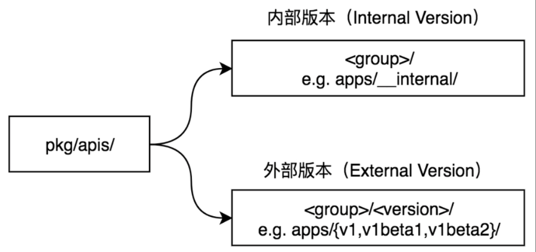
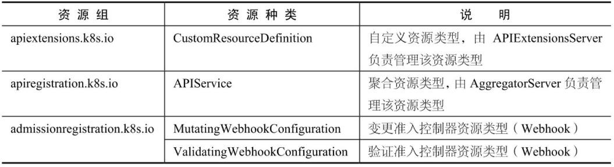

[TOC]

参考：https://weread.qq.com/web/reader/70142ce3643425f426e41306a6b306e4745724c36665436675337376d476f39f21kc9f326d018c9f0f895fb5e4

# Group、Version、Resource核心数据结构

Kubernetes系统虽然有相当复杂和众多的功能，但它本质上是一个资源控制系统——**注册、管理、调度资源并维护资源的状态**。

在Kubernetes庞大而复杂的系统中，只有资源是远远不够的，Kubernetes将资源再次分组和版本化，形成 **Group（资源组）、Version（资源版本）、Resource（资源）**。Group、Version、Resource 核心数据结构如图：

- Group ：被称为资源组，在 Kubernetes API Server 中也可称其为 APIGroup。

- Version ：被称为资源版本，在 Kubernetes API Server 中也可称其为 APIVersions
- Resource ：被称为资源，在 Kubernetes API Server 中也可称其为 APIResource。
- Kind ：资源种类，描述 Resource 的种类，与 Resource 为同一级别。


*Kubernetes 系统支持多个 Group，每个 Group 支持多个 Version，每个 Version支持多个Resource，其中部分资源同时会拥有自己的子资源（即 SubResource）*。例如，Deployment资源拥有Status子资源。

**资源组、资源版本、资源、子资源的完整表现形式为：`<group>/<version>/<resource>/<subresource>**`。以常用的 Deployment 资源为例，其完整表现形式为 apps/v1/deployments/status。

资源对象（Resource Object）也是一个常用概念，由 **“资源组+资源版本+资源种类” 组成，并在实例化后表达一个资源对象**。Deployment资源实例化后拥有资源组、资源版本及资源种类，其表现形式为 `<group>/<version>`，`Kind=<kind>`，例如 `apps/v1`，Kind=Deployment。

每一个资源都拥有一定数量的资源操作方法（即Verbs），资源操作方法用于Etcd集群存储中对资源对象的增、删、改、查操作。**目前Kubernetes系统支持8种资源操作方法，分别是create、delete、deletecollection、get、list、patch、update、watch** 操作方法。

每一个资源都至少有两个版本，分别是**外部版本（External Version）和内部版本（InternalVersion）**。外部版本用于对外暴露给用户请求的接口所使用的资源对象。内部版本不对外暴露，仅在Kubernetes API Server内部使用。

Kubernetes资源也可分为两种，分别是 **Kubernetes Resource（Kubernetes内置资源）和Custom Resource（自定义资源）**。开发者通过CRD（即Custom Resource Definitions）可实现自定义资源，它允许用户将自己定义的资源添加到Kubernetes系统中，并像使用Kubernetes 内置资源一样使用它们。


# ResourceList

Kubernetes **Group、Version、Resource等核心数据结构存放在vendor/k8s.io/apimachinery/pkg/apis/meta/v1目录中**。它包含了Kubernetes集群中所有组件使用的通用核心数据结构，例如 APIGroup、APIVersions、APIResource等。其中，我们可以通过APIResourceList数据结构描述所有Group、Version、Resource的结构，以最常用的Pod、Service 资源为例，APIResourceList Example代码示例如下：


Kubernetes的每个资源可使用 **metav1.APIResource结 构进行描述，它描述资源的基本信息，例如资源名称（即Name字段）、资源所属的命名空间（即Namespaced字段）、资源种类（即Kind字段）、资源可操作的方法列表（即Verbs字段）**。

每一个资源都属于一个或多个资源版本，**资源所属的版本通过 metav1.APIVersions 结构描述，一个或多个资源版本通过 Versions []string 字符串数组进行存储**。

***Group、Version、Resource 简称 GVR***，在Kubernetes源码中该数据结构被大量使用，它被定义在vendor/k8s.io/apimachinery/pkg/runtime/schema中。代码示例如下：


以 Deployment 资源为例：


在vendor/k8s.io/apimachinery/pkg/runtime/schema包中定义了常用的资源数据结构：


**Group、Version、Resource 核心数据结构**详情如图：


# Group

Group（资源组），在Kubernetes API Server中也可称其为APIGroup。Kubernetes系统中定义了许多资源组，这些资源组按照不同功能将资源进行了划分，资源组特点如下:

- 将众多资源**按照功能划分**成不同的资源组，并允许单独 启用/禁用 资源组。当然也可以单独启用/禁用资源组中的资源。
- 支持不同资源组中拥有不同的资源版本。这方便组内的资源根据版本进行迭代升级。
- 支持同名的资源种类（即Kind）存在于不同的资源组内。
- 资源组与资源版本通过 KubernetesAPI Server对外暴露，允许开发者通过 HTTP 协议进行交互并通过动态客户端（即 DynamicClient）进行资源发现。
- 支持CRD自定义资源扩展。
- 用户交互简单，例如在使用 kubectl 命令行工具时，可以不填写资源组名称。

资源组数据结构代码示例如下

代码路径：vendor/k8s.io/apimachinery/pkg/apis/meta/v1/types.go


资源组数据结构字段:

- Name ：资源组名称。
-  Versions ：资源组下所支持的资源版本。
- PreferredVersion ：首选版本。当一个资源组内存在多个资源版本时，Kubernetes API Server在使用资源时会选择一个首选版本作为当前版本。

在当前的Kubernetes系统中，支持两类资源组，分别是拥有组名的资源组和没有组名的资源组。

- 拥有组名的资源组 ：其表现形式为 `<group>/<version>/<resource>`，例如`apps/v1/deployments`。
- 没有组名的资源组 ：被称为 **CoreGroups（即核心资源组）或LegacyGroups，也可被称为GroupLess（即无组）**。其表现形式为 `/<version>/<resource>`，例如 `/v1/pods`。

两类资源组表现形式不同，形成的 HTTP PATH 路径也不同。拥有组名的资源组的 HTTP PATH以/apis为前缀，其表现形式为 `/apis/<group>/<version>/<resource>`，例如 `http://localhost：8080/apis/apps/v1/deployments`。没有组名的资源组的 HTTP PATH以 /api 为前缀，其表现形式为 `/api/<version>/<resource>`，例如 `http://localhost：8080/api/v1/pods`。


# Version

Kubernetes的资源版本控制可分为3种，分别是Alpha、Beta、Stable，它们之间的迭代顺序为 Alpha→Beta→Stable ，其通常用来表示软件测试过程中的3个阶段。

**Alpha 版本**：

Alpha版本为内部测试版本，用于Kubernetes开发者内部测试，该版本是不稳定的，可能存在很多缺陷和漏洞，官方随时可能会放弃支持该版本。在默认的情况下，**处于Alpha版本的功能会被禁用**。Alpha版本名称一般为v1alpha1、v1alpha2、v2alpha1等。

**Beta版本**：

Beta版本为相对稳定的版本，Beta版本经过官方和社区很多次测试，当功能迭代时，该版本会有较小的改变，但不会被删除。在默认的情况下，处于Beta版本的功能是开启状态的。Beta版本命名一般为v1beta1、v1beta2、v2beta1。

**Stable版本**：

Stable版本为正式发布的版本，Stable版本基本形成了产品，该版本不会被删除。在默认的情况下，处于Stable版本的功能全部处于开启状态。Stable版本命名一般为v1、v2、v3。


下面以apps资源组为例，该资源组下的所有资源分别属于v1、v1beta1、v1beta2资源版本，如图：


资源版本数据结构代码示例如下：

代码路径：vendor/k8s.io/apimachinery/pkg/apis/meta/v1/types.go


资源版本数据结构字段说明：

- Versions ：所支持的资源版本列表。


# Resource

## 概述

在整个Kubernetes体系架构中，资源是Kubernetes最重要的概念，可以说 **Kubernetes的生态系统都围绕着资源运作**。Kubernetes系统虽然有相当复杂和众多的功能，但它本质上是一个**资源控制系统——管理、调度资源并维护资源的状态**。

一个**资源被实例化后会表达为一个资源对象（即Resource Object）**。在Kubernetes系统中定义并运行着各式各样的资源对象：


所有**资源对象都是 Entity。Entity 翻译成中文为“实体”**，Kubernetes使用这些Entity来表示当前状态。可以通过Kubernetes API Server进行查询和更新每一个资源对象。Kubernetes目前支持两种Entity：

- **持久性实体（Persistent Entity）** ：在资源对象被创建后，*Kubernetes 会持久确保该资源对象存在。大部分资源对象属于持久性实体，例如 Deployment 资源对象*。

- **短暂性实体（Ephemeral Entity）** ：也可称其为非持久性实体（Non-Persistent Entity）。在资源对象被创建后，如果出现故障或调度失败，不会重新创建该资源对象，例如 *Pod 资源对象*。

资源数据结构代码示例如下：

代码路径：vendor/k8s.io/apimachinery/pkg/apis/meta/v1/types.go


资源数据结构字段说明：

- Name ：资源名称。
- SingularName ：**资源的单数名称**，它必须由小写字母组成，默认使用资源种类（Kind）的小写形式进行命名。例如，Pod 资源的单数名称为 pod，复数名称为 pods。
- Namespaced ：资源是否拥有所属命名空间。
- Group ：资源所在的资源组名称。
-  Version ：资源所在的资源版本。
-  Kind ：资源种类。
-  Verbs ：资源可操作的方法列表，例如 get、list、delete、create、update 等
- ShortNames ：资源的简称，例如 Pod 资源的简称为 po。


## 资源外部版本与内部版本

在Kubernetes系统中，同一资源对应着两个版本，分别是外部版本和内部版本。例如，Deployment 资源，它所属的外部版本表现形式为 apps/v1，内部版本表现形式为apps/__internal。

- External Object ：外部版本资源对象，也称为Versioned Object（即拥有资源版本的资源对象）。**外部版本用于对外暴露给用户请求的接口所使用的资源对象，例如，用户在通过YAML 或 JSON 格式的描述文件创建资源对象时，所使用的是外部版本的资源对象**。外部版本的资源对象通过 *资源版本（Alpha、Beta、Stable）*进行标识。

- Internal Object ：内部版本资源对象。**内部版本不对外暴露，仅在Kubernetes API Server内部使用**。**内部版本用于多资源版本的转换，例如将v1beta1版本转换为v1版本，其过程为v1beta1→internal→v1，即先将v1beta1转换为内部版本（internal），再由内部版本（internal）转换为v1版本**。内部版本资源对象通过 *runtime.APIVersionInternal（即__internal）*进行标识。

**注意：拥有资源版本的资源属于外部版本，拥有 runtime.APIVersionInternal 标识的资源属于内部版本**。

资源的 **外部版本代码定义在 `pkg/apis/<group>/<version>/` 目录下，资源的内部版本代码定义在 `pkg/apis/<group>/` 目录下**。例如，Deployment 资源，它的外部版本定义在`pkg/apis/apps/{v1，v1beta1，v1beta2}/` 目录下，它的内部版本定义在 `pkg/apis/apps/` 目录下（内部版本一般与资源组在同一级目录下）。资源的外部版本与内部版本如图




资源的外部版本和内部版本是需要相互转换的，而**用于转换的函数需要事先初始化到资源注册表（Scheme）中**。**多个外部版本（ExternalVersion）之间的资源进行相互转换，都需要通过内部版本（Internal Version）进行中转。这也是 Kubernetes 能实现多资源版本转换的关键。**

在Kubernetes源码中，外部版本的资源类型定义在 `vendor/k8s.io/api` 目录下，其完整描述路径为 `vendor/k8s.io/api/<group>/<version>/<resource file>`。例如，Pod 资源的外部版本，定义在 `vendor/k8s.io/api/core/v1/` 目录下。

不同资源版本包在源码中的引用路径不同，代码示例如下：


资源的外部版本与内部版本的代码定义也不太一样，外部版本的资源需要对外暴露给用户请求的接口，所以资源代码定义了 JSON Tags 和 ProtoTags，用于请求的序列化和反序列化操作。内部版本的资源不对外暴露，所以没有任何的  JSONTags 和 Proto Tags 定义。以 Pod 资源代码定义为例，代码示例如下。

Pod资源的外部版本代码定义如下：

代码路径：vendor/k8s.io/api/core/v1/types.go


Pod资源的内部版本代码定义如下：

代码路径：pkg/apis/core/types.go


## 资源代码定义

Kubernetes资源代码定义在pkg/apis目录下，同一资源对应着内部版本和外部版本，内部版本和外部版本的资源代码结构并不相同。

资源的内部版本定义了所支持的**资源类型（types.go）、资源验证方法（validation.go）、资源注册至资源注册表的方法（install/install.go）**等。而资源的外部版本定义了**资源的转换方法（conversion.go）、资源的默认值（defaults.go）**等。


1) 以Deployment资源为例，它的内部版本定义在pkg/apis/apps/目录下，其资源代码结构如下：


内部版本的资源代码结构说明：

- doc.go ：GoDoc文件，定义了当前包的注释信息。在Kubernetes资源包中，它还担当了代码生成器的全局Tags描述文件。
- register.go ：定义了 **资源组、资源版本及资源的注册信息**。
- types.go ：定义了在当前资源组、资源版本下所**支持的资源类型**。
-  v1 、v1beta1 、v1beta2 ：定义了资源组下拥有的资源版本的资源（即外部版本）。
- install ：**把当前资源组下的所有资源注册到资源注册表中**。
- validation ：定义了资源的验证方法。
-  zz_generated.deepcopy.go ：定义了资源的深复制操作，该文件由代码生成器自动生成。

每一个Kubernetes资源目录，都通过register.go代码文件定义所属的资源组和资源版本，内部版本资源对象通过 runtime.APIVersionInternal（即__internal）标识，代码示例如下：

代码路径：pkg/apis/apps/register.go

```go
// GroupName is the group name use in this package
const GroupName = "apps"

// SchemeGroupVersion is group version used to register these objects
var SchemeGroupVersion = schema.GroupVersion{Group: GroupName, Version: runtime.APIVersionInternal}
```

每一个Kubernetes资源目录，都通过type.go代码文件定义当前资源组/资源版本下所支持的资源类型，代码示例如下：

代码路径：pkg/apis/apps/types.go

```go
type StatefulSet struct {...}
type StatefulSetUpdateStrategy struct {...}
type Deployment struct {...}
...
```


2) 以Deployment资源为例，它的外部版本定义在pkg/apis/apps/{v1，v1beta1，v1beta2}目录下，其资源代码结构如下：


外部版本的资源代码结构说明如下：

- conversion.go ：**定义了资源的转换函数（默认转换函数）**，并将默认转换函数注册到资源注册表中。
- zz_generated.conversion.go ：定义了资源的转换函数（自动生成的转换函数），并将生成的转换函数注册到资源注册表中。该文件由代码生成器自动生成。
- defaults.go ：**定义了资源的默认值函数**，并将默认值函数注册到资源注册表中。
- zz_generated.defaults.go ：定义了资源的默认值函数（自动生成的默认值函数），并将生成的默认值函数注册到资源注册表中。该文件由代码生成器自动生成。

外部版本与内部版本资源类型相同，都通过register.go代码文件定义所属的资源组和资源版本，外部版本资源对象通过资源版本（Alpha、Beta、Stable）标识，代码示例如下：

代码路径：pkg/apis/apps/v1/register.go

```go
// GroupName is the group name use in this package
const GroupName = "apps"

// SchemeGroupVersion is group version used to register these objects
var SchemeGroupVersion = schema.GroupVersion{Group: GroupName, Version: "v1"}
```


## 将资源注册到资源注册表中

**在每一个Kubernetes资源组目录中，都拥有一个install/install.go代码文件，它负责将资源信息注册到资源注册表（Scheme）中**。以core核心资源组为例，代码示例如下：

代码路径：pkg/apis/core/install/install.go

```go
func init() {
	Install(legacyscheme.Scheme)
}

// Install registers the API group and adds types to a scheme
func Install(scheme *runtime.Scheme) {
	utilruntime.Must(core.AddToScheme(scheme))
	utilruntime.Must(v1.AddToScheme(scheme))
	utilruntime.Must(scheme.SetVersionPriority(v1.SchemeGroupVersion))
}
```

- **`legacyscheme.Scheme` 是 kube-apiserver 组件的全局资源注册表，Kubernetes的所有资源信息都交给资源注册表统一管理**。

- **core.AddToScheme 函数注册 core 资源组内部版本的资源**。

- **v1.AddToScheme 函数注册core资源组外部版本的资源**。

- **scheme.SetVersionPriority 函数注册资源组的版本顺序**，如有多个资源版本，排在最前面的为资源首选版本。


## 资源首选版本

首选版本（Preferred Version），也称优选版本（Priority Version），一个资源组下拥有多个资源版本，例如，apps资源组拥有v1、v1beta1、v1beta2等资源版本。当我们使用apps资源组下的Deployment资源时，在一些场景下，如不指定资源版本，则使用该资源的首选版本。

以apps资源组为例，注册资源时会注册多个资源版本，分别是v1、v1beta2、v1beta1，代码示例如下：

代码路径：pkg/apis/apps/install/install.go

```go
utilruntime.Must(scheme.SetVersionPriority(v1.SchemeGroupVersion, v1beta2.SchemeGroupVersion, v1beta1.SchemeGroupVersion))
```

当通过资源注册表 scheme.PreferredVersionAllGroups 函数获取所有资源组下的首选版本时，**将位于最前面的资源版本作为首选版本**。

代码路径：vendor/k8s.io/apimachinery/pkg/runtime/scheme.go

```go
// PreferredVersionAllGroups returns the most preferred version for every group.
// group ordering is random.
func (s *Scheme) PreferredVersionAllGroups() []schema.GroupVersion {
	ret := []schema.GroupVersion{}
	for group, versions := range s.versionPriority {
		for _, version := range versions {
			ret = append(ret, schema.GroupVersion{Group: group, Version: version})
			break
		}
	}
	...
	return ret
}
```

注意 ：在versionPriority结构中并不存储资源对象的内部版本。

除了scheme.PreferredVersionAllGroups函数外，还有另两个函数用于获取资源版本顺序相关的操作，分别介绍如下。

- scheme.PrioritizedVersionsForGroup：获取指定资源组的资源版本，按照优先顺序返回。
- scheme.PrioritizedVersionsAllGroups：获取所有资源组的资源版本，按照优先顺序返回。

## 资源操作方法

在Kubernetes系统中，针对每一个资源都有一定的操作方法（即Verbs），例如，对于Pod资源对象，可以通过kubectl命令行工具对其执行create、delete、get等操作。Kubernetes系统所支持的操作方法目前有8种操作，分别是 **create、delete、deletecollection、get、list、patch、update、watch。这些操作方法可分为四大类，分别属于增、删、改、查**，对资源进行创建、删除、更新和查询。


资源操作方法可以通过 metav1.Verbs数据结构进行描述，代码示例如下：

代码路径：vendor/k8s.io/apimachinery/pkg/apis/meta/v1/types.go

```go
type Verbs []string

func (vs Verbs) String() string {
	return fmt.Sprintf("%v", []string(vs))
}
```

**不同资源拥有不同的操作方法**，例如，针对Pod资源对象与 `pod/logs` 子资源对象，Pod 资源对象拥有 `create、delete、deletecollection、get、list、patch、update、watch` 等操作方法，`pod/logs` 子资源对象只拥有get操作方法，因为日志只需要执行查看操作。Pod资源对象与 `pod/logs` 子资源对象的操作方法分别通过 `metav1.Verbs` 进行描述：


资源对象的操作方法与存储（Storage）相关联，增、删、改、查实际上都是针对存储的操作。

**如何了解一个资源对象拥有哪些可操作的方法呢**？需要查看与存储相关联的源码包 registry，其定义在 `vendor/k8s.io/apiserver/pkg/registry/` 目录下。每种操作方法对应一个操作方法接口（Interface），资源对象操作方法接口说明：


以 get、create 操作方法为例，rest.Getter 接口定义了Get方法，rest.Create r接口定义了 New 和 Create 方法。如果某个资源对象在存储（Storage）上实现了Get、New 及 Create 方法，就可以认为该资源对象同时拥有了 get 和 create 操作方法。相关接口定义如下：

代码路径：vendor/k8s.io/apiserver/pkg/registry/rest/rest.go

```go
// Getter is an object that can retrieve a named RESTful resource.
type Getter interface {
	// Get finds a resource in the storage by name and returns it.
	// Although it can return an arbitrary error value, IsNotFound(err) is true for the
	// returned error value err when the specified resource is not found.
	Get(ctx context.Context, name string, options *metav1.GetOptions) (runtime.Object, error)
}

// Creater is an object that can create an instance of a RESTful object.
type Creater interface {
	// New returns an empty object that can be used with Create after request data has been put into it.
	// This object must be a pointer type for use with Codec.DecodeInto([]byte, runtime.Object)
	New() runtime.Object

	// Create creates a new version of a resource.
	Create(ctx context.Context, obj runtime.Object, createValidation ValidateObjectFunc, options *metav1.CreateOptions) (runtime.Object, error)
}
```

以Pod资源对象为例，Pod资源对象的存储（Storage）实现了以上接口的方法，Pod资源对象继承了 `genericregistry.Store`，该对象可以管理存储（Storage）的增、删、改、查操作，代码示例如下：

代码路径：vendor/k8s.io/apiserver/pkg/registry/generic/registry/store.go

```go
// Create inserts a new item according to the unique key from the object.
// Note that registries may mutate the input object (e.g. in the strategy
// hooks).  Tests which call this might want to call DeepCopy if they expect to
// be able to examine the input and output objects for differences.
func (e *Store) Create(ctx context.Context, obj runtime.Object, createValidation rest.ValidateObjectFunc, options *metav1.CreateOptions) (runtime.Object, error) {
	...
}
```

以 `pod/logs` 子资源对象为例，该资源对象只实现了 get 操作方法，代码示例如下：

代码路径：pkg/registry/core/pod/storage/storage.go

```go
// PodStorage includes storage for pods and all sub resources
type PodStorage struct {
	Pod                 *REST
	Binding             *BindingREST
	LegacyBinding       *LegacyBindingREST
	Eviction            *EvictionREST
	Status              *StatusREST
	EphemeralContainers *EphemeralContainersREST
	Log                 *podrest.LogREST
	...
}
```

代码路径：pkg/registry/core/pod/rest/log.go

```go
func (r *LogREST) Get(ctx context.Context, name string, opts runtime.Object) (runtime.Object, error) {
	// register the metrics if the context is used.  This assumes sync.Once is fast.  If it's not, it could be an init block.
	registerMetrics()
  ...
}
```


## 资源与命名空间

Kubernetes 系统支持命名空间（Namespace），其用来解决 Kubernetes 集群中资源对象过多导致管理复杂的问题。每个命名空间相当于一个“虚拟集群”，不同命名空间之间可以进行隔离，当然也可以通过某种方式跨命名空间通信。

Kubernetes系统中默认内置了4个命名空间，分别介绍如下：

- default ：所有未指定命名空间的资源对象都会被分配给该命名空间。
- kube-system ：所有由Kubernetes系统创建的资源对象都会被分配给该命名空间。
- kube-public ：此命名空间下的资源对象可以被所有人访问（包括未认证用户）。
- kube-node-lease ：此命名空间下存放来自节点的心跳记录（节点租约信息）。

大部分资源对象都存在于某些命名空间中（例如 Pod 资源对象）。但**并不是所有的资源对象都存在于某个命名空间中**（例如Node资源对象）。决定资源对象属于哪个命名空间，可通过资源对象的ObjectMeta.Namespace描述，以Pod资源对象为例，资源与命名空间数据结构如图


描述某个Pod资源对象属于default命名空间，代码示例如下：


**通过如下命令可以查看哪些 Kubernetes 资源对象属于命名空间，而哪些资源对象不属于命名空间**，执行命令如下：


## 自定义资源

Kubernetes系统拥有强大的高扩展功能，其中自定义资源（Custom Resource）就是一种常见的扩展方式，即可将自己定义的资源添加到Kubernetes系统中。


## 资源对象描述文件定义

Kubernetes资源可分为内置资源（KubernetesResources）和自定义资源（CustomResources），它们都通过资源对象描述文件（Manifest File）进行定义。

**一个资源对象需要用5个字段来描述它，分别是 Group/Version、Kind、MetaData、Spec、Status**。这些字段定义在YAML或JSON文件中。


资源对象描述文件说明如下：

- apiVersion ：指定创建资源对象的资源组和资源版本，其表现形式为`<group>/<version>`，若是core资源组（即核心资源组）下的资源对象，其表现形式为`<version>`。
- kind ：指定创建资源对象的种类。
- metadata ：描述创建资源对象的元数据信息，例如名称、命名空间等。
-  spec ：包含有关Deployment资源对象的核心信息，告诉Kubernetes期望的资源状态、副本数量、环境变量、卷等信息。
-  status ：包含有关正在运行的Deployment资源对象的信息。

每一个Kubernetes资源对象都包含两个嵌套字段，即 spec 字段和 status 字段。其中 **spec 字段是必需的，它描述了资源对象的“期望状态”（Desired State），而status字段用于描述资源对象的“实际状态”（Actual State）**，它是由Kubernetes系统提供和更新的。在任何时刻，Kubernetes控制器一直努力地管理着对象的实际状态以与期望状态相匹配。


# Kubernetes内置资源全图

Kubernetes系统内置了众多 “资源组、资源版本、资源”，这才有了现在功能强大的资源管理系统。可通过如下方式获得当前Kubernetes系统所支持的内置资源。

- **kubectl api-versions** ：列出当前 Kubernetes 系统支持的资源组和资源版本，其表现形式为 `<group>/<version>`。
-  **kubectl api-resources** ：列出当前 Kubernetes 系统支持的 Resource 资源列表。


Kubernetes内置资源说明:




# runtime.Object类型基石

Runtime被称为“运行时”，我们在很多其他程序或语言中见过它，它一般指**程序或语言核心库的实现**。Kubernetes Runtime 在 `vendor/k8s.io/apimachinery/pkg/runtime` 中实现，它提供了通用资源类型 runtime.Object。

*runtime.Object 是 Kubernetes 类型系统的基石*。Kubernetes上的所有资源对象（Resource Object）实际上就是一种 Go 语言的 Struct 类型，相当于一种数据结构，它们都有一个共同的结构叫 runtime.Object。runtime.Object 被设计为 Interface接口 类型，作为资源对象的通用资源对象，runtime.Obejct 类型基石如图：


以资源对象Pod为例，该资源对象可以转换成 runtime.Object 通用资源对象，也可以从runtime.Object 通用资源对象转换成 Pod 资源对象。runtime.Object结构如下：

代码路径：vendor/k8s.io/apimachinery/pkg/runtime/interfaces.go

```go
type Object interface {
	GetObjectKind() schema.ObjectKind
	DeepCopyObject() Object
}
```

代码路径：vendor/k8s.io/apimachinery/pkg/runtime/schema/interfaces.go

```go
type ObjectKind interface {
	// SetGroupVersionKind sets or clears the intended serialized kind of an object. Passing kind nil
	// should clear the current setting.
	SetGroupVersionKind(kind GroupVersionKind)
	// GroupVersionKind returns the stored group, version, and kind of an object, or an empty struct
	// if the object does not expose or provide these fields.
	GroupVersionKind() GroupVersionKind
}
```

runtime.Object提供了两个方法，分别是GetObjectKind和DeepCopyObject。

- GetObjectKind ：用于设置并返回 GroupVersionKind。
- DeepCopyObject ：用于深复制当前资源对象并返回。

**深复制相当于将数据结构克隆一份，因此它不与原始对象共享任何内容**。它使代码在不修改原始对象的情况下可以改变克隆对象的任何属性。


*如何确认一个资源对象是否可以转换成 runtime.Object 通用资源对象呢？*

这时需要确认该资源对象是否拥有 `GetObjectKind` 和 `DeepCopyObject` 方法。*Kubernetes的每一个资源对象都嵌入了 `metav1.TypeMeta` 类型*，**`metav1.TypeMeta` 类型实现了GetObjectKind 方法**，所以资源对象拥有该方法。另外，**Kubernetes 的每一个资源对象都实现了 DeepCopyObject 方法**，该方法一般被定义在 zz_generated.deepcopy.go 文件中。因此，可以认为该资源对象能够转换成 runtime.Object 通用资源对象。

所以，Kubernetes 的任意资源对象都可以通过 runtime.Object 存储它的类型并允许深复制操作。通过 runtime.ObjectExample 代码示例，可以将资源对象转换成通用资源对象并再次转换回资源对象。runtime.Object Example 代码示例如下：


在以上代码示例中:

1. 首先实例化 Pod 资源，得到 Pod 资源对象，通过 `runtime.Object` 将 Pod 资源对象转换成通用资源对象（得到 obj）。

2. 然后通过断言的方式，将 obj 通用资源对象转换成Pod资源对象（得到 pod2）。
3. 最终通过reflect（反射）来验证转换之前和转换之后的资源对象是否相等。


# Unstructured数据

**数据可以分为结构化数据（Structured Data）和非结构化数据（Unstructured Data）**，Kubernetes内部会经常处理这两种数据。

## 结构化数据

预先知道数据结构的数据类型是结构化数据。例如，JSON数据：


要使用这种数据，需要创建一个 struct 数据结构，其具有 id 和 name 属性：


通过Go语言的json库进行反序列化操作，将 id 和 name 属性映射到 struct 中对应的 ID 和 Name 属性中。

## 非结构化数据

无法预知数据结构的数据类型或属性名称不确定的数据类型是非结构化数据，其无法通过构建预定的struct数据结构来序列化或反序列化数据。例如：


我们无法事先得知 description 的数据类型，它可能是字符串，也可能是数组嵌套等。原因在于 Go 语言是强类型语言，它需要预先知道数据类型，Go 语言在处理 JSON 数据时不如动态语言那样便捷。当无法预知数据结构的数据类型或属性名称不确定时，通过如下结构来解决问题：

```go
var result map[string]interface{}
```

每个字符串对应一个 JSON 属性，其映射 `interface{}` 类型对应值，可以是任何类型。使用 interface 字段时，通过 Go 语言断言的方式进行类型转换：

```go
if description, ok := result["description"].(string); ok {
  fmt.Println(description)
}
```

## Kubernetes非结构化数据处理

代码路径：vendor/k8s.io/apimachinery/pkg/runtime/interfaces.go

```go
// Unstructured objects store values as map[string]interface{}, with only values that can be serialized
// to JSON allowed.
type Unstructured interface {
	Object
	// NewEmptyInstance returns a new instance of the concrete type containing only kind/apiVersion and no other data.
	// This should be called instead of reflect.New() for unstructured types because the go type alone does not preserve kind/apiVersion info.
	NewEmptyInstance() Unstructured
	// UnstructuredContent returns a non-nil map with this object's contents. Values may be
	// []interface{}, map[string]interface{}, or any primitive type. Contents are typically serialized to
	// and from JSON. SetUnstructuredContent should be used to mutate the contents.
	UnstructuredContent() map[string]interface{}
	// SetUnstructuredContent updates the object content to match the provided map.
	SetUnstructuredContent(map[string]interface{})
	// IsList returns true if this type is a list or matches the list convention - has an array called "items".
	IsList() bool
	// EachListItem should pass a single item out of the list as an Object to the provided function. Any
	// error should terminate the iteration. If IsList() returns false, this method should return an error
	// instead of calling the provided function.
	EachListItem(func(Object) error) error
	// EachListItemWithAlloc works like EachListItem, but avoids retaining references to a slice of items.
	// It does this by making a shallow copy of non-pointer items before passing them to fn.
	//
	// If the items passed to fn are not retained, or are retained for the same duration, use EachListItem instead for memory efficiency.
	EachListItemWithAlloc(func(Object) error) error
}
```

在上述代码中，Kubernetes 非结构化数据通过 map[string]interface{} 表达，并提供接口。在**client-go 编程式交互的 DynamicClient 内部，实现 了Unstructured 类型，用于处理非结构化数据**。


# Scheme资源注册表

## 概述

Kubernetes系统拥有众多资源，每一种资源就是一个资源类型，这些资源类型需要有统一的注册、存储、查询、管理等机制。目前Kubernetes系统中的所有资源类型都已注册到Scheme资源注册表中，其是一个内存型的资源注册表，拥有如下特点。

- 支持注册多种资源类型，包括内部版本和外部版本。
- 支持多种版本转换机制。
- 支持不同资源的序列化/反序列化机制。

Scheme 资源注册表支持两种资源类型（Type）的注册，分别是 UnversionedType 和 KnownType 资源类型，分别介绍如下：

- UnversionedType ：无版本资源类型，这是一个早期 Kubernetes 系统中的概念，它主要应用于某些没有版本的资源类型，该类型的资源对象并不需要进行转换。在目前的 Kubernetes 发行版本中，无版本类型已被弱化，几乎所有的资源对象都拥有版本，但在 metav1 元数据中还有部分类型，它们既属于 meta.k8s.io/v1 又属于 UnversionedType 无版本资源类型，例如metav1.Status、metav1.APIVersions、metav1.APIGroupList、metav1.APIGroup、metav1.APIResourceList。
- KnownType ：是目前Kubernetes最常用的资源类型，也可称其为“拥有版本的资源类型”。

在Scheme资源注册表中，UnversionedType资源类型的对象通过 `scheme.AddUnversionedTypes`方法进行注册，KnownType 资源类型的对象通过 `scheme.AddKnownTypes` 方法进行注册。


## Scheme 资源注册表数据结构

Scheme 资源注册表数据结构主要由 4 个 map 结构组成，它们分别是 **gvkToType、typeToGVK、unversionedTypes、unversionedKinds**，代码示例如下：

代码路径：vendor/k8s.io/apimachinery/pkg/runtime/scheme.go

```go
type Scheme struct {
	// gvkToType allows one to figure out the go type of an object with
	// the given version and name.
	gvkToType map[schema.GroupVersionKind]reflect.Type

	// typeToGVK allows one to find metadata for a given go object.
	// The reflect.Type we index by should *not* be a pointer.
	typeToGVK map[reflect.Type][]schema.GroupVersionKind

	// unversionedTypes are transformed without conversion in ConvertToVersion.
	unversionedTypes map[reflect.Type]schema.GroupVersionKind

	// unversionedKinds are the names of kinds that can be created in the context of any group
	// or version
	// TODO: resolve the status of unversioned types.
	unversionedKinds map[string]reflect.Type
  ...
}
```

Scheme资源注册表结构字段说明如下：

- **gvkToType **：存储 GVK 与 Type 的映射关系。
- **typeToGVK** ：存储 Type 与 GVK 的映射关系，一个 Type 会对应一个或多个 GVK。
- **unversionedTypes** ：存储 UnversionedType 与 GVK 的映射关系。
- **unversionedKinds** ：存储 Kind（资源种类）名称与 UnversionedType 的映射关系。

Scheme 资源注册表通过 Go 语言的 map 结构实现映射关系，这些映射关系可以实现高效的正向和反向检索，从 Scheme 资源注册表中检索某个 GVK 的 Type，它的时间复杂度为 O(1)。资源注册表映射关系1如图：


Scheme资源注册表在Kubernetes系统体系中属于非常核心的数据结构，若直接阅读源码会感觉比较晦涩，通过SchemeExample代码示例来理解Scheme资源注册表，印象会更深刻。Scheme Example代码示例如下：

```go
package main

import (
	appsv1 "k8s.io/api/apps/v1"
  corev1 "k8s.io/api/core/v1"
  metav1 "k8s.io/apimachinery/pkg/apis/meta/v1"
  "k8s.io/apimachinery/pkg/runtime"
  "k8s.io/apimachinery/pkg/runtime/schema"
)

func main(){
  // KnownType external
  coreGV := schema.GroupVersion{Group: "", Version: "v1"}
  extensionGV := schema.GroupVersion{Group: "extensions", Version:"v1beta1"}
  
  // Known internal
  coreInternalGV := schema.GroupVersion{Group: "", Version: "v1"}
  
  // UnversionedType
  Unversioned := schema.GroupVersion{Group: "", Version: "v1"}
  
  schema := runtime.NewSchema()
  schema.AddKnownTypes(coreGV, &corev1.Pod{})
  schema.AddKnownTypes(extensionGV, &appsv1.DaemonSet{})
  schema.AddKnownTypes(coreInternalGV, &corev1.Pod{})
  schema.AddUnversionedTypes(Unversioned, &metav1.Status{})
}

```

在上述代码中，首先定义了两种类型的GV（资源组、资源版本），KnownType 类型有coreGV、extensionsGV、coreInternalGV 对象，其中 coreInternalGV 对象属于内部版本（即runtime.APIVersionInternal），而 UnversionedType 类型有 Unversioned 对象。

通过runtime.NewScheme实例化一个新的Scheme资源注册表。注册资源类型到Scheme资源注册表有两种方式:

- 第一种通过 `scheme.AddKnownTypes` 方法注册 KnownType 类型的对象
- 第二种通过 `scheme.AddUnversionedTypes` 方法注册 UnversionedType 类型的对象。

在 Scheme Example 代码示例中，我们往 Scheme 资源注册表中分别注册了 Pod、DaemonSet、Pod（内部版本）及 Status（无版本资源类型）类型对象，那么这些资源的映射关系如图:


GVK（资源组、资源版本、资源种类）在 Scheme 资源注册表中以 `<group>/<version>`，`Kind=<kind>` 的形式存在，其中对于 Kind（资源种类）字段，在注册时如果不指定该字段的名称，那么默认使用类型的名称，例如 `corev1.Pod` 类型，通过 reflect 机制获取资源类型的名称，那么它的资源种类 `Kind=Pod`。

资源类型在Scheme资源注册表中以 Go Type（通过reflect机制获取）形式存在。

另外，需要注意的是，UnversionedType 类型的对象在通过 `scheme.AddUnversionedTypes` 方法注册时，会同时存在于 4 个 map 结构中，代码示例如下：

代码路径：vendor/k8s.io/apimachinery/pkg/runtime/scheme.go

```go
func (s *Scheme) AddUnversionedTypes(version schema.GroupVersion, types ...Object) {
	...
	s.AddKnownTypes(version, types...)
	for _, obj := range types {
		t := reflect.TypeOf(obj).Elem()
		gvk := version.WithKind(t.Name())
		s.unversionedTypes[t] = gvk
		...
		s.unversionedKinds[gvk.Kind] = t
	}
}
```


## 资源注册表注册方法

在 Scheme 资源注册表中，不同的资源类型使用的注册方法不同，分别介绍如下：

- `scheme.AddUnversionedTypes` ：注册 UnversionedType 资源类型。
- `scheme.AddKnownTypes` ：注册 KnownType 资源类型。
- `scheme.AddKnownTypeWithName` ：注册 KnownType 资源类型，须指定资源的 Kind资 源种类名称。

以scheme.AddKnownTypes方法为例，在注册资源类型时，无须指定Kind名称，而是通过reflect机制获取资源类型的名称作为资源种类名称，代码示例如下：

代码路径：vendor/k8s.io/apimachinery/pkg/runtime/scheme.go

```go
func (s *Scheme) AddKnownTypes(gv schema.GroupVersion, types ...Object) {
	s.addObservedVersion(gv)
	for _, obj := range types {
		t := reflect.TypeOf(obj)
		if t.Kind() != reflect.Pointer {
			panic("All types must be pointers to structs.")
		}
		t = t.Elem()
		s.AddKnownTypeWithName(gv.WithKind(t.Name()), obj)
	}
}
```


## 资源注册表查询方法

在运行过程中，kube-apiserver 组件常对 Scheme 资源注册表进行查询，它提供了如下方法:

- `scheme.KnownTypes` ：查询注册表中指定GV下的资源类型。
- `scheme.AllKnownTypes` ：查询注册表中所有GVK下的资源类型。
- `scheme.ObjectKinds` ：查询资源对象所对应的GVK，一个资源对象可能存在多个GVK。
- `scheme.New` ：查询 GVK 所对应的资源对象。
- `scheme.IsGroupRegistered `：判断指定的资源组是否已经注册。
- `scheme.IsVersionRegistered `：判断指定的GV是否已经注册。
- `scheme.Recognizes `：判断指定的GVK是否已经注册。
- `scheme.IsUnversioned `：判断指定的资源对象是否属于 UnversionedType 类型。


# Codec编解码器

## 概述

Codec编解码器与Serializer序列化器之间的差异:

- **Serializer ：序列化器**，包含序列化操作与反序列化操作。序列化操作是将数据（例如数组、对象或结构体等）转换为字符串的过程，反序列化操作是将字符串转换为数据的过程，因此可以轻松地维护数据结构并存储或传输数据。
- **Codec ：编解码器**，包含编码器与解码器。编解码器是一个通用术语，指的是可以表示数据的任何格式，或者**将数据转换为特定格式**的过程。所以，可以将 Serializer 序列化器也理解为 Codec 编解码器的一种。

Codec编解码器通用接口定义如下：

代码路径：vendor/k8s.io/apimachinery/pkg/runtime/interfaces.go

```go
type Encoder interface {
	Encode(obj Object, w io.Writer) error
	Identifier() Identifier
}

type Decoder interface {
	Decode(data []byte, defaults *schema.GroupVersionKind, into Object) (Object, *schema.GroupVersionKind, error)
}

type Serializer interface {
	Encoder
	Decoder
}

type Codec Serializer
```

Serializer序列化器属于Codec编解码器的一种，这是因为每种序列化器都实现了Encoder与Decoder方法。我们可以认为，只要实现了Encoder与Decoder方法的数据结构，就是序列化器。Kubernetes目前支持3种主要的序列化器。Codec编解码器如图


Codec编解码器包含3种序列化器，在进行编解码操作时，每一种序列化器都对资源对象的metav1.TypeMeta（即APIVersion和Kind字段）进行验证，如果资源对象未提供这些字段，就会返回错误。每种序列化器分别实现了Encode序列化方法与Decode反序列化方法，分别介绍如下。

- jsonSerializer ：JSON格式序列化/反序列化器。它使用 `application/json` 的ContentType作为标识。
- yamlSerializer ：YAML格式序列化/反序列化器。它使用 `application/yaml` 的ContentType 作为标识。
- protobufSerializer ：Protobuf格式序列化/反序列化器。它使用`application/vnd.kubernetes.protobuf` 的 ContentType 作为标识。

**Codec 编解码器将Etcd集群中的数据进行编解码操作**。


## Codec编解码实例化

**Codec 编解码器通过 NewCodecFactory 函数实例化，在实例化的过程中会将 jsonSerializer、yamlSerializer、protobufSerializer 序列化器全部实例化**，NewCodecFactory→newSerializersForScheme 代码示例如下：

代码路径：vendor/k8s.io/apimachinery/pkg/runtime/serializer/codec_factory.go

```go
func newSerializersForScheme(scheme *runtime.Scheme, mf json.MetaFactory, options CodecFactoryOptions) []serializerType {
	jsonSerializer := json.NewSerializerWithOptions(
		mf, scheme, scheme,
		json.SerializerOptions{Yaml: false, Pretty: false, Strict: options.Strict},
	)
	...
	yamlSerializer := json.NewSerializerWithOptions(
		mf, scheme, scheme,
		json.SerializerOptions{Yaml: true, Pretty: false, Strict: options.Strict},
	)
	...
  
	serializers := []serializerType{
		jsonSerializerType,
		{
			AcceptContentTypes: []string{runtime.ContentTypeYAML},
			ContentType:        runtime.ContentTypeYAML,
			FileExtensions:     []string{"yaml"},
			...
		},
		{
			AcceptContentTypes: []string{runtime.ContentTypeProtobuf},
			ContentType:        runtime.ContentTypeProtobuf,
			FileExtensions:     []string{"pb"},
			...
		},
	}

	for _, fn := range serializerExtensions {
		...
	}
	return serializers
}
```

更多关于 序列化的详情参考：https://weread.qq.com/web/reader/70142ce3643425f426e41306a6b306e4745724c36665436675337376d476f39f21?


# Converter资源版本转换器

## 概述

在Kubernetes系统中，同一资源拥有多个资源版本，Kubernetes系统允许同一资源的不同资源版本进行转换，例如Deployment资源对象，当前运行的是v1beta1资源版本，但v1beta1资源版本的某些功能或字段不如v1资源版本完善，则可以将Deployment资源对象的v1beta1资源版本转换为v1版本。可**通过 `kubectl convert`命令进行资源版本转换**，执行命令如下：

```shell
$ kubectl covert -f vebata1Deploy.yaml --output-version=apps/v1
```

首先，定义一个YAML Manifest File资源描述文件，该文件中定义Deployment资源版本为v1beta1。通过执行kubect convert命令，`--output-version` 将资源版本转换为指定的资源版本v1。**如果指定的资源版本不在 Scheme 资源注册表中，则会报错。如果不指定资源版本，则默认转换为资源的首选版本**。

Converter 资源版本转换器主要用于解决多资源版本转换问题，Kubernetes系统中的一个资源支持多个资源版本，如果要在每个资源版本之间转换，最直接的方式是，每个资源版本都支持其他资源版本的转换，但这样处理起来非常麻烦。例如，某个资源对象支持3个资源版本，那么就需要提前定义一个资源版本转换到其他两个资源版本`（v1→v1alpha1，v1→v1beta1）、（v1alpha1→v1，v1alpha1→v1beta1）及（v1beta1→v1，v1beta1→v1alpha1）`，随着资源版本的增加，资源版本转换的定义会越来越多。

为了解决这个问题，Kubernetes通过内部版本（InternalVersion）机制实现资源版本转换，Converter资源版本转换过程1如图：


## Converter转换器数据结构

Converter转换器数据结构主要存放转换函数（即ConversionFuncs）。Converter转换器数据结构代码示例如下：

代码路径：vendor/k8s.io/apimachinery/pkg/conversion/converter.go

```go
// Converter knows how to convert one type to another.
type Converter struct {
	// Map from the conversion pair to a function which can
	// do the conversion.
	conversionFuncs          ConversionFuncs
	generatedConversionFuncs ConversionFuncs

	// Set of conversions that should be treated as a no-op
	ignoredUntypedConversions map[typePair]struct{}
}
```

- conversionFuncs ：默认转换函数。这些转换函数一般定义在资源目录下的 conversion.go代码文件中。
- generatedConversionFuncs ：自动生成的转换函数。这些转换函数一般定义在资源目录下的 zz_generated.conversion.go 代码文件中，是由代码生成器自动生成的转换函数。
- ignoredConversions ：若资源对象注册到此字段，则忽略此资源对象的转换操作。

Converter 转换器数据结构中存放的转换函数（即ConversionFuncs）可以分为两类，分别为默认的转换函数（即 conversionFuncs 字段）和自动生成的转换函数（即generatedConversionFuncs 字段）。它们都通过 ConversionFuncs 来管理转换函数，代码示例如下：

```go
type ConversionFuncs struct {
  fns map[typePair]reflect.Value
  untyped map[typePair]ConversionFunc
}

type typePair struct {
  source reflect.Type
  dest	reflect.Type
}
type ConversionFunc func(a, b interface{}, scope Scope) error
```

ConversionFunc 类型函数（即 Type Function）定义了转换函数实现的结构，将资源对象 a 转换为资源对象 b。a 参数定义了转换源（即 source）的资源类型，b 参数定义了转换目标（即 dest）的资源类型。scope 定义了多次转换机制（即递归调用转换函数）。

**注意 ：ConversionFunc 类型函数的资源对象传参必须是指针，否则无法进行转换并抛出异常。**


## Converter 注册转换函数

Converter 转换函数需要通过注册才能在 Kubernetes 内部使用，目前 Kubernetes 支持5个注册转换函数，分别介绍如下：

- `scheme.AddIgnoredConversionType` ：注册忽略的资源类型，不会执行转换操作，忽略资源对象的转换操作。
- `scheme.AddConversionFuncs` ：注册多个 Conversion Func 转换函数。
- `scheme.AddConversionFunc` ：注册单个 Conversion Func 转换函数。
- `scheme.AddGeneratedConversionFunc` ：注册自动生成的转换函数。
- `scheme.AddFieldLabelConversionFunc` ：注册字段标签（FieldLabel）的转换函数。

以 apps/v1 资源组、资源版本为例，通过 `scheme.AddConversionFuncs` 函数注册所有资源的转换函数，代码示例如下：


## Converter资源版本转换原理

Converter 转换器在 Kubernetes 源码中实际应用非常广泛，例如 Deployment 资源对象，起初使用 v1beta1 资源版本，而 v1 资源版本更稳定，则会将 v1beta1 资源版本转换为 v1 资源版本。Converter 资源版本转换过程如图:


Converter转换器通过Converter函数转换资源版本，直接阅读代码会感觉比较晦涩，通过Converter Example代码示例来理解Converter转换器印象会更深刻，Converter Example代码示例如下：


**第1部分** ：实例化一个空的Scheme资源注册表，将v1beta1资源版本、v1资源版本及内部版本（__internal）的Deployment资源注册到Scheme资源注册表中。

**第2部分** ：实例化 `v1beta1Deployment` 资源对象，通过 `scheme.ConvertToVersion` 将其转换为目标资源版本（即__internale版本），得到 objInternal 资源对象，objInternal 资源对象的 GVK 输出为`/，Kind=`。

**提示** ：**当资源对象的GVK输出为 `/，Kind=` 时，我们同样认为它是内部版本的资源对象**，在后面章节中会说明原因。

**第3部分** ：将objInternal 资源对象通过 `scheme.ConvertToVersion` 转换为目标资源版本（即v1资源版本），得到objV1资源对象，并通过断言的方式来验证是否转换成功，objV1资源对象的GVK输出为 `apps/v1，Kind=Deployment`。

在 Converter Example 代码示例的第 2 部分中，将 v1beta1 资源版本转换为内部版本（即`__internal` 版本），得到转换后资源对象的GVK为 `/，Kind=`。

Scheme资源注册表可以通过两种方式进行版本转换，分别介绍如下：

- `scheme.ConvertToVersion `：将传入的（in）资源对象转换成目标（target）资源版本，在版本转换之前，会将资源对象深复制一份后再执行转换操作，相当于安全的内存对象转换操作。
- `scheme.UnsafeConvertToVersion` ：与 `scheme.ConvertToVersion` 功能相同，但在转换过程中不会深复制资源对象，而是直接对原资源对象进行转换操作，尽可能高效地实现转换。但该操作是非安全的内存对象转换操作。

`scheme.ConvertToVersion` 与 `scheme.UnsafeConvertToVersion` 资源版本转换功能都依赖于 `s.convertToVersion` 函数来实现，Converter 转换器流程图：


### 1.获取传入的资源对象的反射类型

资源版本转换的类型可以是 `runtime.Object` 或 `runtime.Unstructured`，它们都属于Go语言里的 Struct 数据结构，通过 Go 语言标准库reflect机制获取该资源类型的反射类型，因为在Scheme 资源注册表中是以反射类型注册资源的。获取传入的资源对象的反射类型，代码示例如下：

代码路径：vendor/k8s.io/apimachinery/pkg/runtime/scheme.go

```go
t = reflect.TypeOf(in).Elem()
```

### 2.从资源注册表中查找到传入的资源对象的GVK

从 Scheme 资源注册表中查找到传入的资源对象的所有 GVK，验证传入的资源对象是否已经注册，如果未曾注册，则返回错误，代码示例如下：

```go
kinds, ok := s.typeToGVK[t]
if !ok || len(kinds) == 0 {
  return nil, NewNotRegistererdErrForType(s.schemeName, t)
}
```

### 3.从多个GVK中选出与目标资源对象相匹配的GVK

`target.KindForGroupVersionKinds` 函数从多个可转换的 GVK 中选出与目标资源对象相匹配的 GVK。这里有一个优化点，转换过程是相对耗时的，大量的相同资源之间进行版本转换的耗时会比较长。在 Kubernetes 源码中判断，如果目标资源对象的 GVK 在可转换的 GVK 列表中，则直接将传入的资源对象的 GVK 设置为目标资源对象的 GVK，而无须执行转换操作，缩短部分耗时。代码示例如下：

```go
gvk, ok := target.KindForGroupVersionKinds(kinds)
...
for _, kinds := range kinds {
  if gvk == kind {
    return copyAndSetTargetKind(copy, in, gvk)
  }
}
```

### 4.判断传入的资源对象是否属于Unversioned类型

对于Unversioned类型，前面曾介绍过，即无版本类型（UnversionedType）。属于该类型的资源对象并不需要进行转换操作，而是直接将传入的资源对象的GVK设置为目标资源对象的GVK。代码示例如下：

```go
if UnversionedKind, ok := s.unversionedTypes[t]; ok{
  ...
  return copyAndSetTargetKind(copy, in, UnversionedKind)
}
```

### 5.执行转换操作

在执行转换操作之前，先判断是否需要对传入的资源对象执行深复制操作，然后通过`s.converter.Convert `转换函数执行转换操作，代码示例如下：

```go
if copy {
  in = in.DeepCopyObject()
}

if err := s.converter.Convert(in, out, flags, meta); err != nil {
  return nil, err
}
```

实际的转换函数是通过 doConversion 函数执行的，执行过程如下：

- 从默认转换函数列表（即c.conversionFuncs）中查找出pair对应的转换函数，如果存在则执行该转换函数（即fn）并返回。
- 从自动生成的转换函数列表（即generatedConversionFuncs）中查找出pair对应的转换函数，如果存在则执行该转换函数（即fn）并返回。
- 如果默认转换函数列表和自动生成的转换函数列表中都不存在当前资源对象的转换函数，则使用doConversion函数传入的转换函数（即f）。调用f之前，需要将src与dest资源对象通过EnforcePtr函数取指针的值，因为doConversion函数传入的转换函数接收的是非指针资源对象。

doConversion 转换函数代码示例如下：

代码路径：vendor/k8s.io/apimachinery/pkg/conversion/converter.go


### 6.设置转换后资源对象的GVK

在Converter Example代码示例的第2部分中，将v1beta1资源版本转换为内部版本（即__internal版本），得到转换后资源对象的GVK为“/，Kind=”。原因在于setTargetKind函数，转换操作执行完成以后，通过setTargetKind函数设置转换后资源对象的GVK，判断当前资源对象是否为内部版本（即APIVersionInternal），是内部版本则设置GVK为schema.GroupVersionKind{}。代码示例如下：

代码路径：vendor/k8s.io/apimachinery/pkg/runtime/scheme.go


