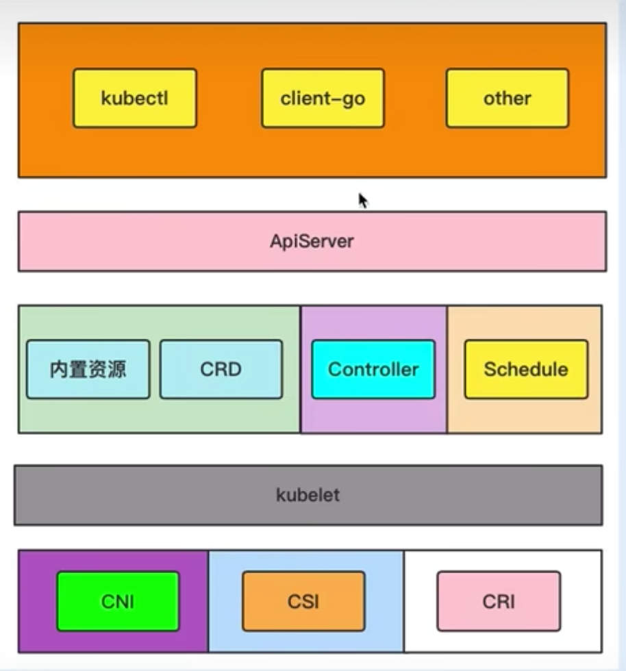
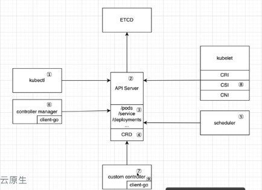

# 开篇

## Kubernetes 资源扩展

## API类型的选择

| 考虑 API 聚合的情况                                          | 优先独立 API 的情况                                          |
| ------------------------------------------------------------ | :----------------------------------------------------------- |
| 你在开发新的 API                                             | 已经有一个提供API服务的程序并且工作良好                      |
| 你希望在 Kubernetes UI 中和其他内置类别一起查看你的新资源类别 | 不要求 kubectl 支持                                          |
| 你希望复用 Kubernetes API 支持特性                           | 不需要 Kubernetes UI 支持                                    |
| 你有意愿接受 Kubernets 对 REST 资源路径所做的格式限制，例如 API 组和命名空间 | 你不需要这些特性                                             |
| 你的 API 是声明式的                                          | 你的API 不符合声明式模型                                     |
| 你的资源可以自然地界定为集群作用域或集群中某个命名空间作用域 | 集群作用域的命名空间作用域这种二分法很不合适；需要对资源路径的细节进行控制 |

## 相关工具

Client-go: https://github.com/kubernetes/client-go

sample-controller(controller示例): https://github.com/kubernetes/sample-controller

kubebuilder(快速创建controller的工具): https://github.com/kubernetes-sigs/kubebuilder  https://book.kubebuilder.io/

sample-apiserver(apiserver示例):https://github.com/kubernetes/sample-apiserver

## kubernetes 扩展点

## K8s 控制器模式

在机器人技术和自动化领域，控制回路（Control Loop）是一个非终止的回路，用于调节系统状态。将其应用于 K8s 中，控制器的含义是通过监控集群的公共状态，并致力于将其**状态转变为期望的状态**。至于如何转变，有**控制器循环处理相应的逻辑**。一个控制器至少跟踪一种类型的 Kubernetes 资源。该**资源的控制器负责确保其当前状态（Status）接近期望状态（Spec）**。不通的控制器相互配合完成一项复杂的任务。

内置资源的控制器和自定义资源的控制，都会通过 client-go 来与 API Server 进行交互，client-go 中提供了控制器的大部分实现，只需在此基础上通过少量代码便可以写出符合 k8s 设计原则的控制器。

